<h1 align="center">IDOR ZAFİYETLERİ</h1>

# Web Uygulaması ve Kullanıcı Arasındaki İlişki

Bir web uygulaması kullanıcıdan girdiler alarak çalışır. Yani bizler web sayfasıyla etkileşime geçer ve onun veri tabanına girdiler yollarız. Çoğu web uygulamasında etkileşime geçebileceğimiz çok fazla alan vardır. Örneğin bir alışveriş sitesinde kendi adresimizi ya da ödeme bilgilerimizi kaydedebiliriz. Bu işlemleri yaparken de aslında uygulamanın veri tabanına çok fazla direktif veririz.Çoğu web uygulamasında da kullanıcının etkileşime geçebildiği çok fazla alan olması sebebiyle bu web uygulamalarının veri tabanında karmaşık ve katmanlı yapılar oluşur. Bu katmanlı ve karmaşık yapılar birbirleri ile iç içe geçmiş olduğundan zaafiyete açık hale gelebilir ve veri sızıntısı söz konusu olabilir.

# IDOR (Insecure Direct Object Reference)

Yukarıdaki yazıda web uygulamasının veri tabanı ile kullanıcı arasındaki ilişkiden bahsetmiştik. Kullanıcı veri tabanına web uygulamasının izin verdiği ölçüde erişebiliyor. Örnek olarak web sitelerinin bize çeşitli alanlarda(adres ekleme, satış bilgilerini kaydetme gibi) verdiği izinler gösterilebilir. Burada 'web uygulamasının izin verdiği ölçü' aslında kilit noktadır. Güvenli bir uygulamada kullanıcıların web uygulaması üzerindeki yetkileri sınırlı olmalıdır ki hem kullanabilsinler hem de veri sızmasın. 

Örneğin biz kendi adresimizi web uygulamasına kaydediyoruz ama aynı zamanda bir başkasının adresini görmemeliyiz. Eğer web uygulamasında böyle bir zaafiyet var ise ve kendimizin dışında başkasının adresini de görebiliyorsak  burada IDOR kategorisinde bir zaafiyet olduğunu söyleyebiliriz. En basit haliyle IDOR zaafiyeti budur.

* Zaten Türkçeleştirecek olursak da; **güvensiz doğrudan obje referansı** oluyor. Yani; **bir obje referansına(örneğimizde 'adres bilgisi' olarak verdiğimiz) güvensiz bir şekilde doğrudan erişim** olarak düşünebiliriz.

# Uygulamalı Anlatım

* Bu uygulamalı anlatımda zaafiyetli tasarlanmış bir web uygulaması üzerinden anlatım gerçekleştireceğiz.

* Çalışırken **Burp Suite** isimli bir araç kullanacağız.
    * Burp Suite'i bir hacker kumandası olarak düşünebiliriz. Web uygulama güvenliği ile ilgili işlemleri daha hızlı ve verimli şekilde gerçekleştirmek üzere geliştirilmiştir. 

* Örnek web uygulaması:

    **İlk Hesap**

    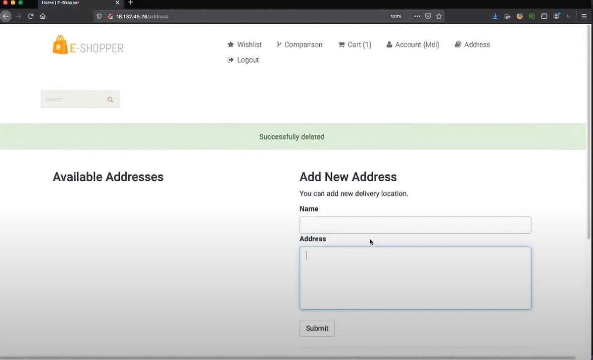

* Burada görüldüğü üzere web uygulamasına giriş yapılmış ve adresler kısmındayız. 

* Aynı uygulama farklı bir tarayıcıdan farklı bir hesapla da yan tarafta açılıyor:

    **İkinci Hesap**

    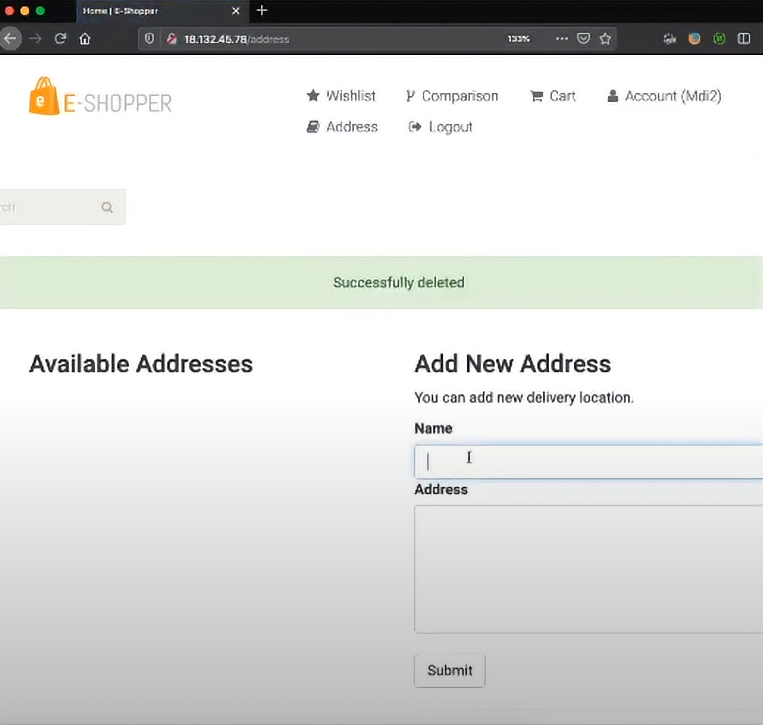

* İlk hesaba bir adres ekleniyor **'MDI-1 Adresi'** adında:

    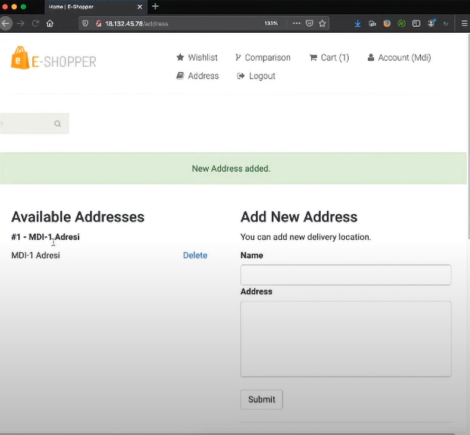

* İkinci hesaba da bir adres ekleniyor. İsmi **'MDI-2 Adresi'**:

    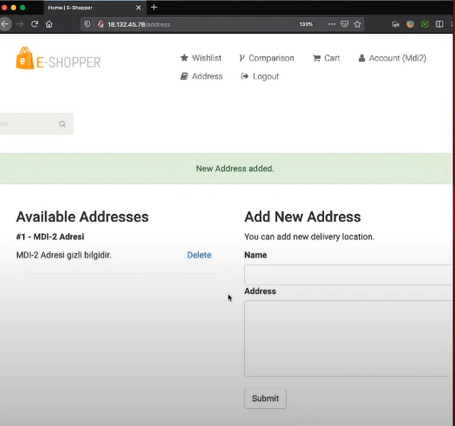

* İlk hesaptaki adres web uygulamasından silindiği vakit **Burp Suite** uygulamasında şöyle bir çıktı alınıyor:

    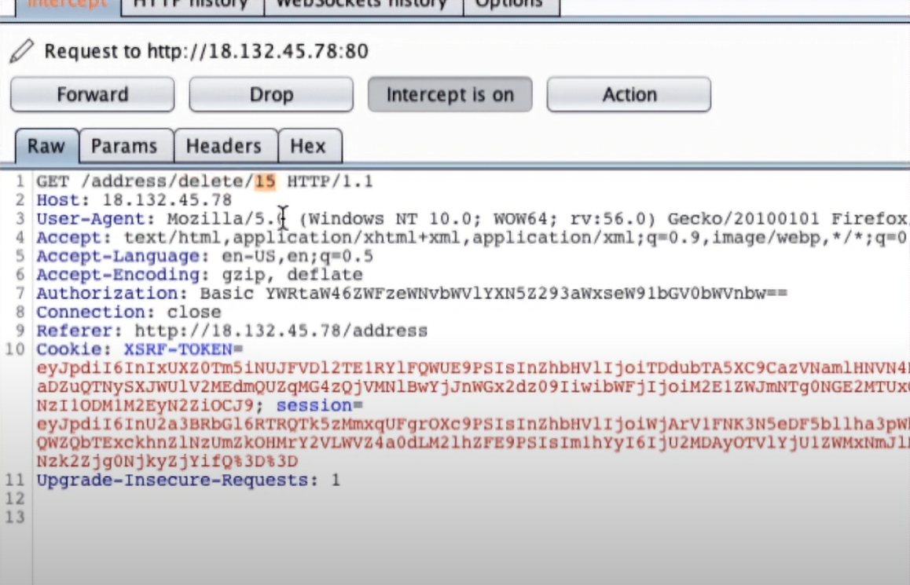

    * Dikkat ederseniz ilk satırda **'adress/delete/15'** yazan bir kısım var. Burada adress isimli bir kontrolcü olmalı çünkü
    zaten adresler kısmından silme işlemi yapılmıştı. Yanında da **'delete'** yazıyor çünkü silme işlemi yapıldı. Onun yanında da **15** yazıyor. Bu sayı, söz konusu adresin veritabanında ifade edildiği id(kimlik) değeridir. Bir id olduğundan eminiz ama ne tür bir id olduğunu henüz bilmiyoruz. 

* Şimdi yukarıdaki işlemin aynısını ikinci hesaptaki kullanıcı için de yapılıyor. Yani ikinci hesabın adresi uygulama üzerinden siliniyor ve **Burp Suite**'den çıktıya bakılıyor:

    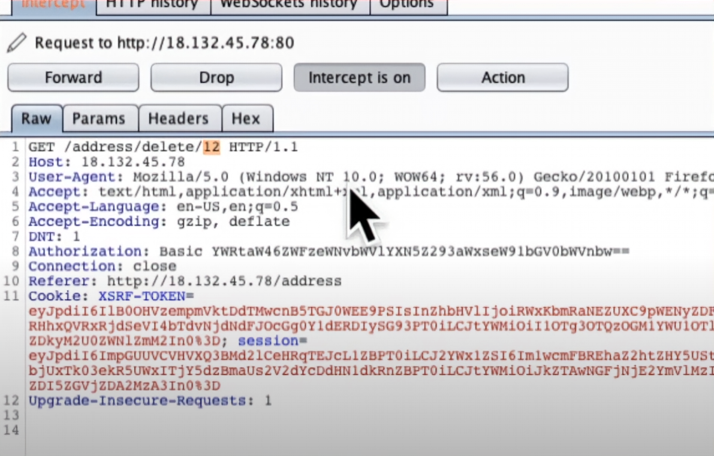

    * Burada ilk satırda **adress/delete/12** göze çarpıyor. Görüldüğü üzere 15 olan id değeri bu sefer 12. Buradan veri tabanındaki id değerinin kullanıcıların id değeri olduğunu yorumlayabiliriz. Ama bu halen bir varsayımdır.   

    * Şimdi burada 12 yerine 15 yazıp bu kodu tekrar çalıştırırsak idsi 15 olan kullancının adresi silinir mi? Bunu görmek için kodun sonundaki 12 yerine 15 yazılıyor ve forward tuşuna  basılıyor. Sunucudan şu şekil bir cevap geliyor:

        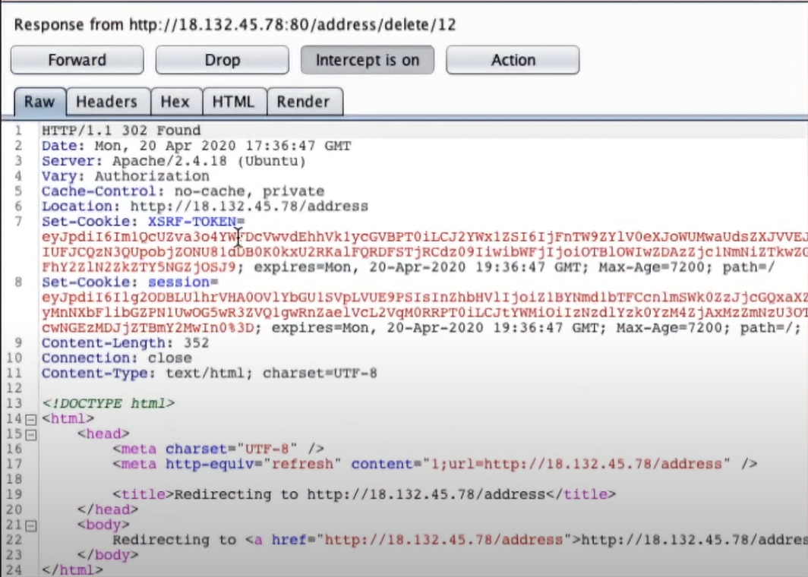

        * '302 found' yazıyor. Buradan sistemin bir error(hata) üretmediğini söyleyebiliyoruz. Ama bu yanıltıcı bir varsayım olur çünkü '302 found' bilgisi verilse dahi bu sadece bir geri dönüştür. Bu yüzden siteye gidip adress kısmına tekrar giriliyor ve arayüzde şöyle bir mesaj ile karşılaşılıyor:

            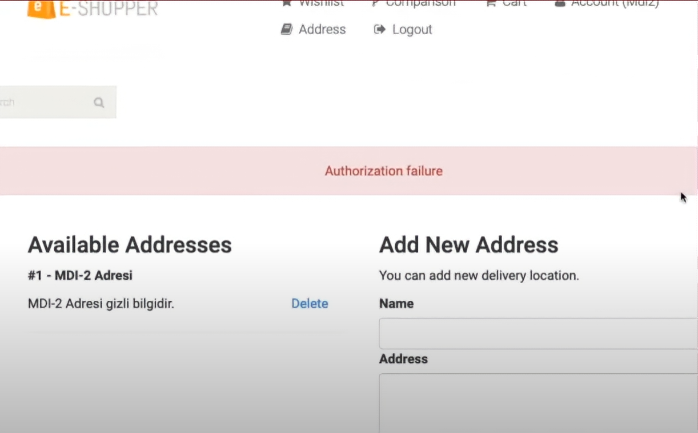

            * **'Authorization failure(yetkilendirme başarısız)'** geri dönüşünü alıyoruz. Ancak bunun yazıyor oluşu bu siteden veri sızdırılamayacağı anlamına gelmiyor. 
    

* Tekrardan 1. kullanıcının adres bilgilerine gittiğimizde ise adresin silinmediğini görebiliyoruz:

    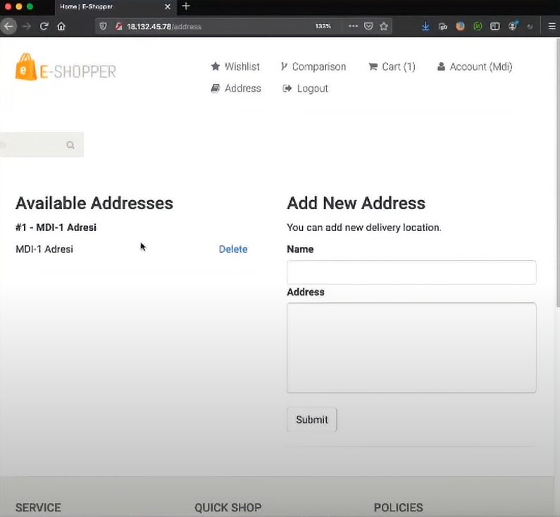

* Şimdi id olarak çok uzun bi sayı yazılıyor ve sunucunun ne tepki vereceği ölçülüyor:

    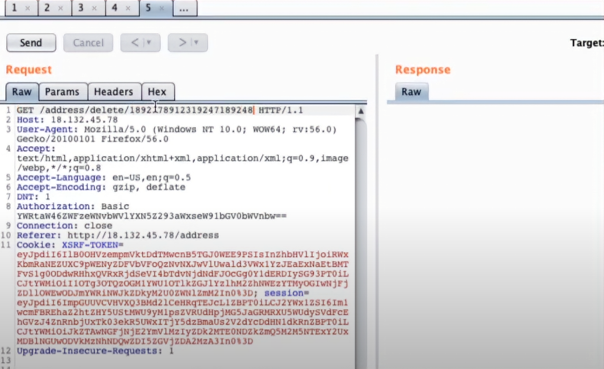

* Bu sefer gelen yanıt **'404 Not Found'** hata mesajı oluyor.  

    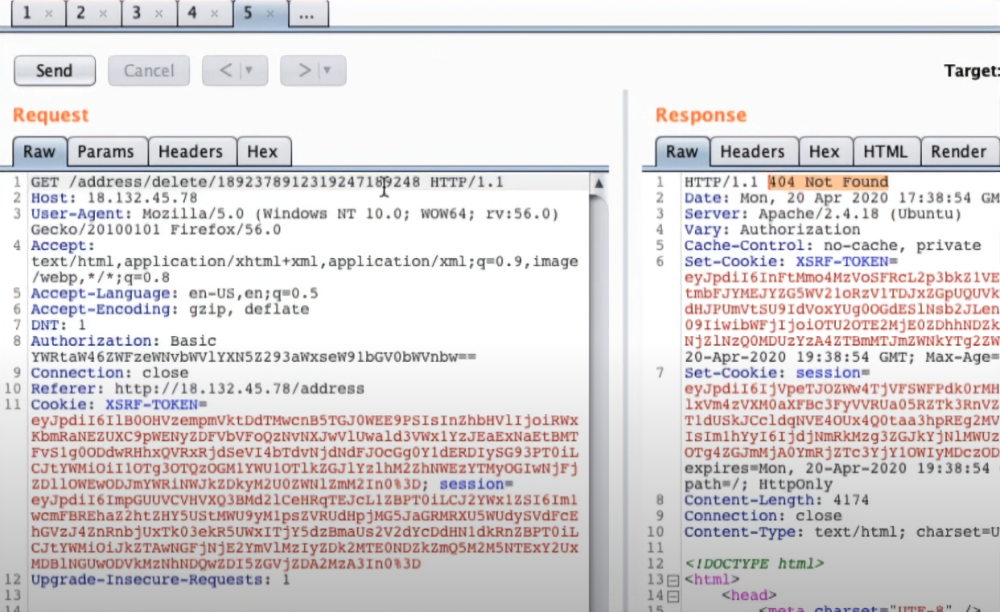

* Buradan uygulamanın davranışından veritabanında nasıl çalıştığına dair izler görebiliriz. Şu ana kadar uygulamanın adres kimliklerinin varlığı üzerinden bir çıktı ürettiğini gördük. 12 ve 15 var olan adresler olduğu için error mesajı üretmedi. Ancak çok absürt bir sayı girdiğimizde öyle bir adres muhtemelen olmadığı için **'404 Not Found'** hatası aldık. Buradan tersine mühendislik yapar arkaplandaki çalışma mantığına yönelik varsayımlarda bulunabiliyoruz. 

* Sonuç olarak bu web uygulamasında **IDOR** zaafiyetinden bahsedemeyiz. Çünkü bir kullanıcının hesabından başka bir kullanıcının adresini silmek başarılamıyor. Eğer silinebilseydi IDOR'dan bahsedebilirdik. 

