<h1 align="center">Session’ı ve CSRF Zafiyetini Anlamak & SameSite Cookie Önlemi</h1>

# HTTP (Hypertext Transfer Protocol) 

Günümüzde internetin çalışmasında en büyük role sahiptir. Http'yi bir metin aktarım protokolü(çeşitli kurallar bütünü) olarak düşünebiliriz. İlk başta bazı üniversiteler arasındaki veri transferleri gibi basit ihtiyaçlar için kullanılıyordu. Dolayısıyla şu anda karmaşık bir uygulamanın sahip olması gereken iyi bir güvenlik yapısı taşımadığını söyleyebiliriz. Her zaman kullanıcının sorgusu karşısında sunucudan bir cevap gelir. Yani buradaki veri sadece iki taraflıdır. Sunucu ve kullanıcı arasındadır. 

# TCP 3-Way Handshake

## TCP (Transmission Control Protocol)/IP Model Nedir?

TCP, aktarım kontrol protokolüdür. Verinin iletiminden önce paketlere ayrılmasını ve karşı tarafta bu paketlerin yeniden düzgün bir şekilde birleştirilmesini sağlar. Bu şekilde kayıpsız veri gönderimi amaçlanır. Bu protokolün 4 katmanı bulunur. Bu katmanlarda, ağ erişimine sahip cihazlarda çalışan uygulamaların birbiriyle nasıl iletişim kurdukları ve kuracakları tanımlanır.

* 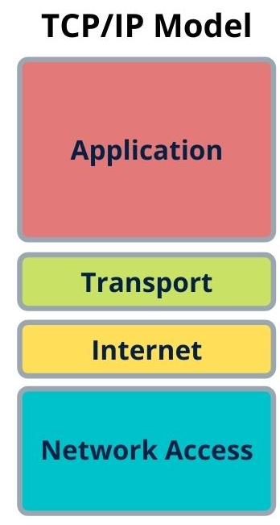

    * Application (Uygulama): Veriyi oluşturan katman. (HTTP/HTTPS)
    * Transport (Taşıma): Hatasız bir veri bağlantısı kurulan ortam. Veriyi küçük paketlere böler.
    * Network (Ağ): Veriyi doğru ağa yönlendirir. Paketleri ağa gönderir ve paketlerin gönderildiğinden emin olur.(Ipv4/Ipv6)
    * Network Access: Hedef MAC Adresini ekler. İnternetteki uygulamalar arasında veri gönderimi yapar. Fiziksel altyapıyı işler.
        * MAC(Media Access Control Address), medya erişimi kontrol adresi olarak düşünülebilir. Cihazın üreticileri tarafından atanan adreslerdir. Örnek, “68-7F-74-12-34-56” bu dizin bir MAC adresi örneğidir. Adresin ilk altı hanesi üreticiyi temsil eder, son altı hane ise özgün bir tanıtıcı numaradır.  Bilgisayar ağında bir cihazın ağ donanımını tanımaya yarar:

        *    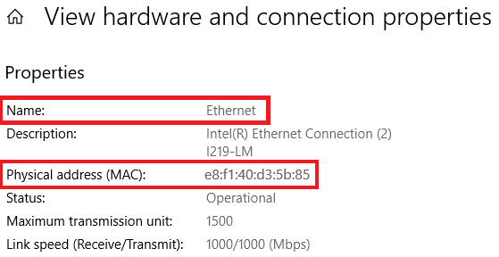

### OSI:

 OSI(Open System Interconnection), açık sistemler arasındaki bağlantılar olarak düşünülebilir. OSI bir protokoldür ve 7 katmandan oluşur.

* 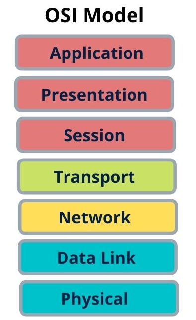

    * Application(Uygulama): Kullanıcıya en yakın katmandır. Burada uygulama servisleri sağlanmaktadır. HTTP bu katmandadır.

        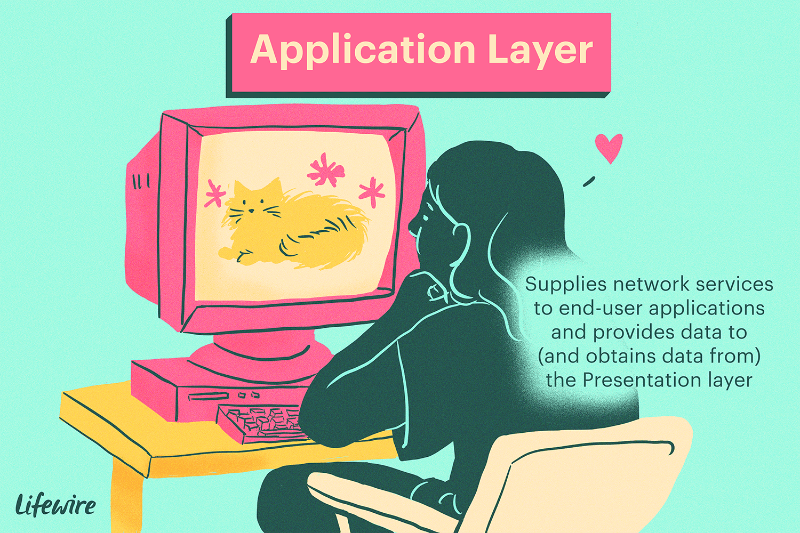

    * Presentation(Sunum): Kullanılabilir veriyi şifreler ya da sıkıştırır. WMV, JPEG, PNG bu katmandadır.

        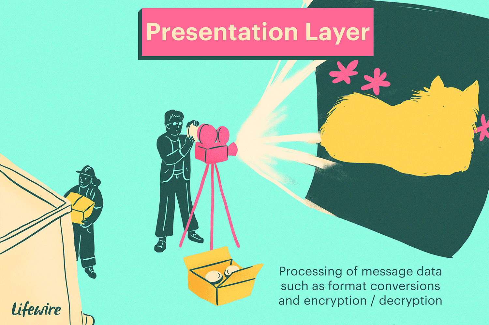

    * Session(Oturum): Oturumların kurulduğu, yönetildiği ve sonlandırıldığı kısım.

        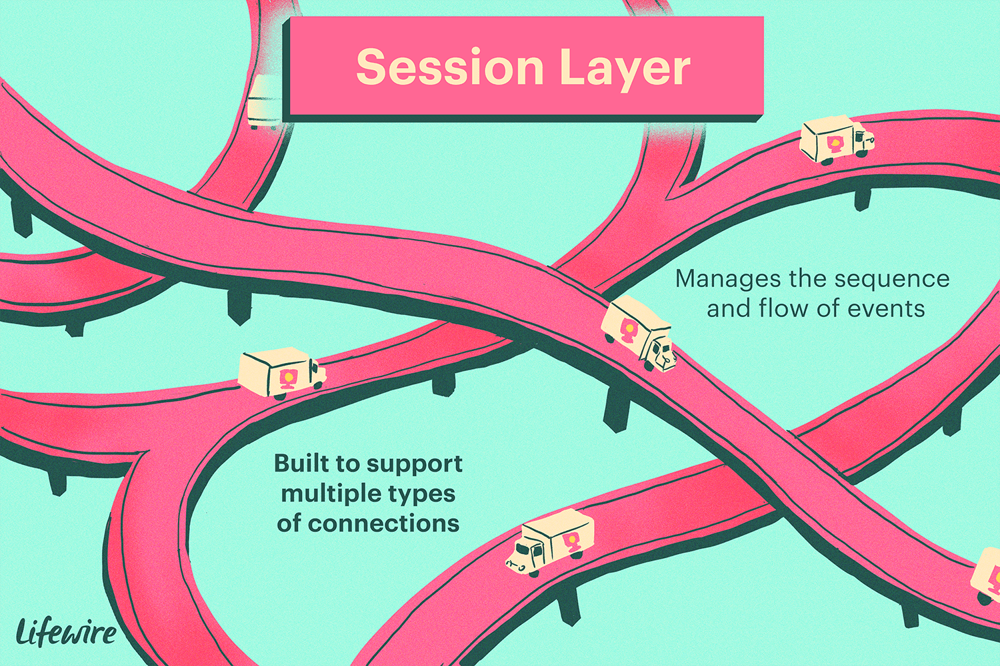

    * Transport(Taşıma): Taşıma protokolleri(TCP&UDP) kullanarak verileri taşır.
        
        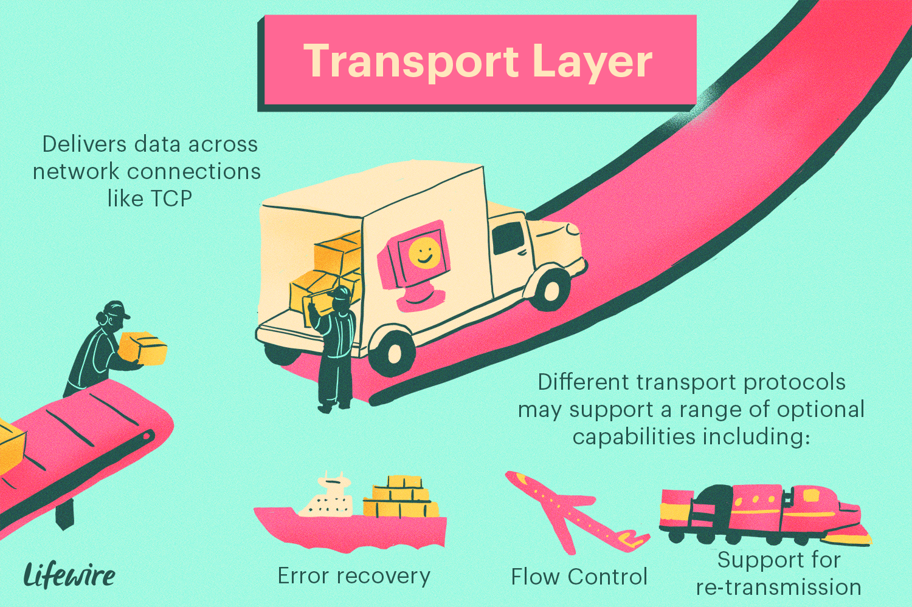

    * Network(Ağ): Global(evrensel, herkes tarafından erişilebilir) adresleri arayüzlere taşır ve farklı ağlar arasındaki en iyi rotayı belirler. IP bu katmandadır.

        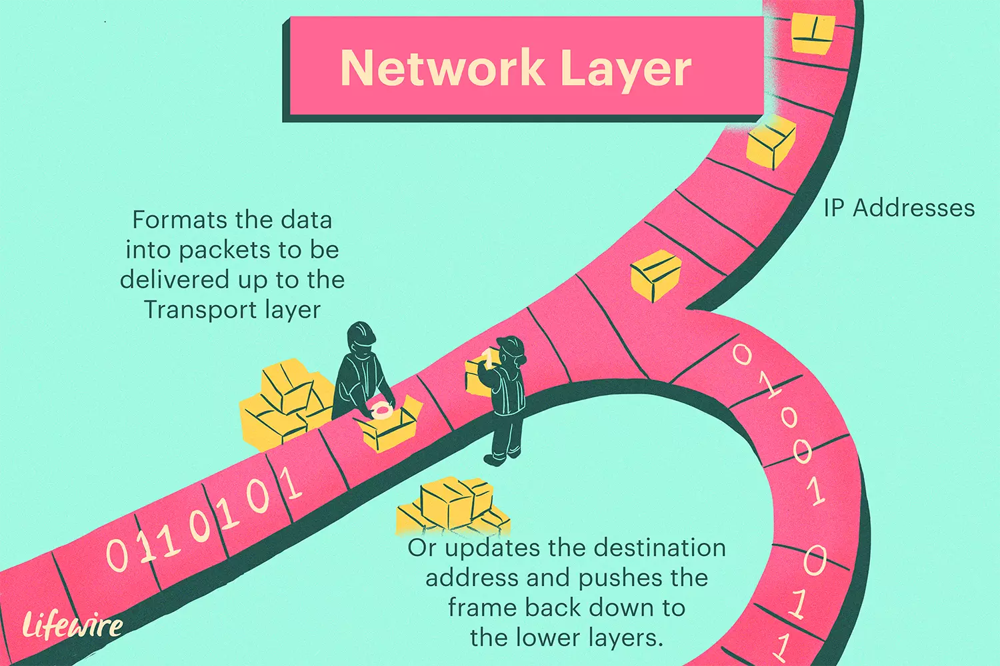

    * Data Link(Data Link): Local(yerel, kısıtlı erişim) adresleri arayüzlere taşır. Bilgiyi local olarak taşır.(Mac Method)

        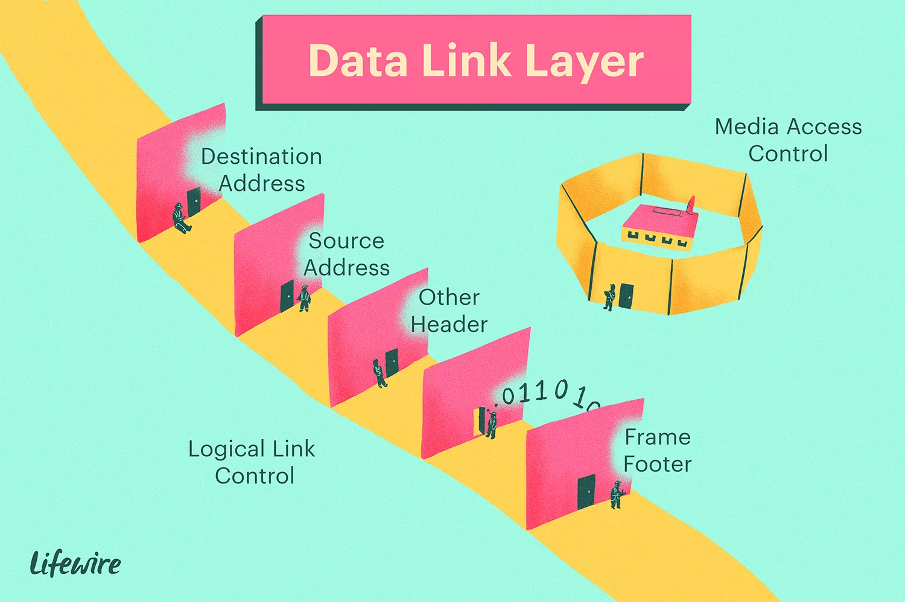

    * Physical(Fiziksel): Sinyalleri, kabloları ve bağlayıcıları(örn, ethernet kablosunun en uç kısmı) şifreler. 

        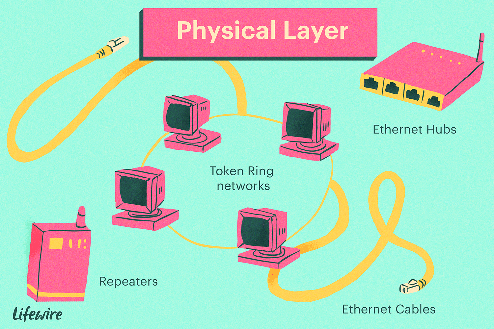

^
### OSI ve TCP/IP karşılaştırması:

    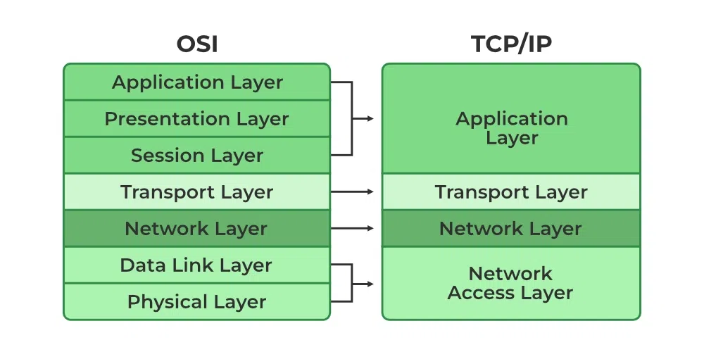

