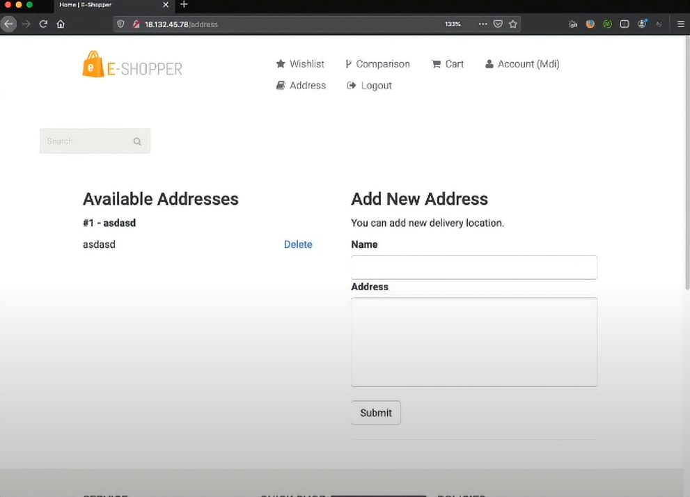
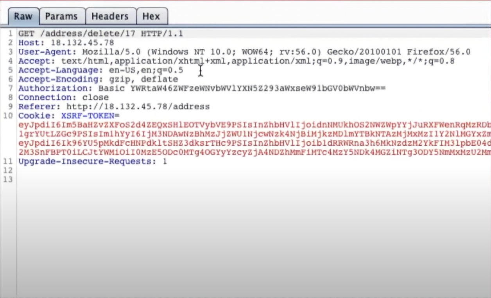
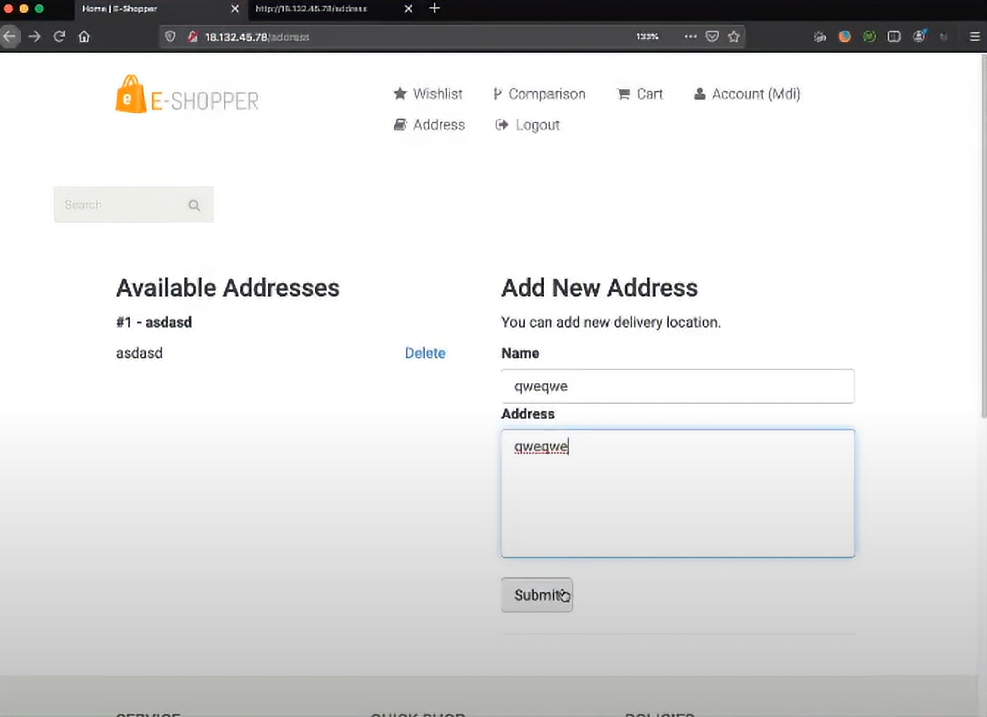
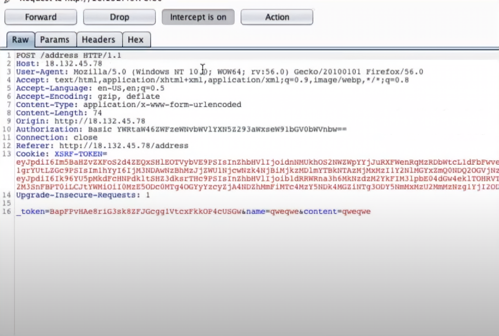
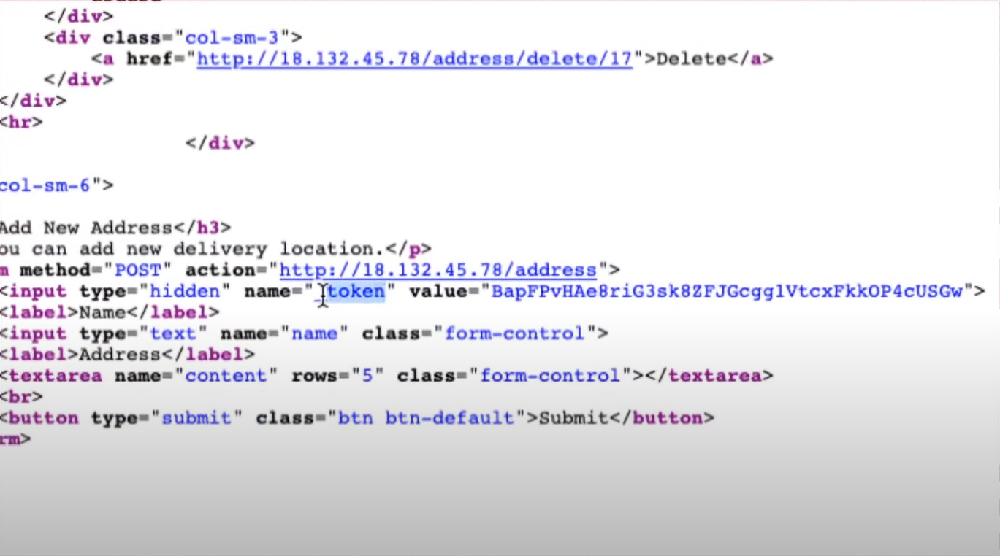

<h1 align="center">Session’ı ve CSRF Zafiyetini Anlamak & SameSite Cookie Önlemi</h1>

# HTTP (Hypertext Transfer Protocol) 

Günümüzde internetin çalışmasında en büyük role sahiptir. Http'yi bir metin aktarım protokolü(çeşitli kurallar bütünü) olarak düşünebiliriz. Bilginin sunucudan kullanıcıya nasıl ve ne şekilde aktarılacağını gösteren protokoldür. Web sayfalarının görüntülenmesini sağlar. İlk başta bazı üniversiteler arasındaki veri transferleri gibi basit ihtiyaçlar için kullanılıyordu. Dolayısıyla şu anda karmaşık bir uygulamanın sahip olması gereken iyi bir güvenlik yapısını taşımadığını söyleyebiliriz. Her zaman kullanıcının sorgusu karşısında sunucudan bir cevap gelir. Yani buradaki veri sadece iki taraflıdır. Sunucu ve kullanıcı arasındadır.

## HTTPS(Secure Hyper Text Transfer Protocol) 
Aynı http gibi bir protokoldür. Güvenli Metin Aktarma Protokolü olarak düşünebiliriz. HTTP ve HTTPS temelde aynı işi yapsa da HTTPS'de güvenlik ön plandadır. Sondaki 's' takısını secure(güvenli) olarak düşünebiliriz. Kısacası internet sitelerinin metinlerle kurduğu bağlantı sertifikalar aracılığıyla şifrelenmektedir. 

# TCP 3-Way Handshake

## TCP (Transmission Control Protocol)/IP Nedir?

TCP, aktarım kontrol protokolüdür. Verinin iletiminden önce paketlere ayrılmasını ve karşı tarafta bu paketlerin yeniden düzgün bir şekilde birleştirilmesini sağlar. Bu şekilde kayıpsız veri gönderimi amaçlanır. Bu protokolün 4 katmanı bulunur. Bu katmanlarda, ağ erişimine sahip cihazlarda çalışan uygulamaların birbiriyle nasıl iletişim kurdukları ve kuracakları tanımlanır.

* 

    * Application (Uygulama): Veriyi oluşturan katman. (HTTP/HTTPS)

    * Transport (Taşıma): Hatasız bir veri bağlantısı kurulan ortam. Veriyi küçük paketlere böler.

    * Network (Ağ): Veriyi doğru ağa yönlendirir. Paketleri ağa gönderir ve paketlerin gönderildiğinden emin olur.(Ipv4/Ipv6)

    * Network Access: Hedef MAC Adresini ekler. İnternetteki uygulamalar arasında veri gönderimi yapar. Fiziksel altyapıyı işler.

        * MAC(Media Access Control Address), medya erişimi kontrol adresi olarak düşünülebilir. Cihazın üreticileri tarafından atanan adreslerdir. Örnek, “68-7F-74-12-34-56” bu dizin bir MAC adresi örneğidir. Adresin ilk altı hanesi üreticiyi temsil eder, son altı hane ise özgün bir tanıtıcı numaradır.  Bilgisayar ağında bir cihazın ağ donanımını tanımaya yarar:

        *    


## OSI(Open System Interconnection) Nedir?

 OSI, açık sistemler arasındaki bağlantılar olarak düşünülebilir. OSI yukarıda anlattığımız TCP gibi bir protokoldür ve 7 katmandan oluşur. Bu katmanlarla, ağ farkındalığına sahip cihazlarda çalışan uygulamaların birbirleriyle nasıl iletişim kuracakları tanımlanır.


* 

    * Application(Uygulama): Kullanıcıya en yakın katmandır. Burada uygulama servisleri sağlanmaktadır. HTTP bu katmandadır.

        

    * Presentation(Sunum): Kullanılabilir veriyi şifreler ya da sıkıştırır. WMV, JPEG, PNG bu katmandadır.

        

    * Session(Oturum): Oturumların kurulduğu, yönetildiği ve sonlandırıldığı kısım.

        

    * Transport(Taşıma): Taşıma protokolleri(TCP&UDP) kullanarak verileri taşır.
        
        

    * Network(Ağ): Global(evrensel, herkes tarafından erişilebilir) adresleri arayüzlere taşır ve farklı ağlar arasındaki en iyi rotayı belirler. IP bu katmandadır.

        

    * Data Link(Data Link): Local(yerel, kısıtlı erişim) adresleri arayüzlere taşır. Bilgiyi local olarak taşır.(Mac Method)

        

    * Physical(Fiziksel): Sinyalleri, kabloları ve bağlayıcıları(örn, ethernet kablosunun en uç kısmı) şifreler. 

        

^
### OSI ve TCP/IP karşılaştırması:

*    


## TCP 3-Way Handshake(3 yönlü el sıkışma)

TCP/IP ağı üzerinden iki cihaz arasında güvenilir bağlantı kuran bir süreçtir. 3 adımdan oluştuğu için 3 yönlü el sıkışma adı almıştır. Amaç bu 3 adımda doğrulama yapmaktır. Doğrulamaya bir örnek:


***A kişisi: Merhaba ben seninle konuşmak istiyorum***

***B kişisi: Merhaba benimle konuşmak istediğini duydum. Seninle konuşmaya müsaitim***

***A kişisi: Seninle konuşmak istediğimi söylemiştim sen de bunu duymuşsun ve müsait olduğunu söylemişsin. Hadi konuşalım.***

Görüldüğü üzere 3 taraflı bir doğrulama söz konusu. TCP 3-Way Handshake en basit haliyle budur ve doğrulama ile ilgilidir.


## HTTP ve Authentication(doğrulama)
* Bazı kavramlar:
    * 'Cookie': Bir anahtar veya kimlik.
    * 'Session': Oturum. Kimliğe dair bilgileri içerir. Yukarıdaki OSI şemasında görmüştük. 

* Http'nin yapısında doğrulama desteği yoktur. Bu yüzden doğrulama sistemi cookie(çerezler)'ler ile çalışır.

* Http head ve body kısımlarından oluşur. Önemli bilgilerin head bölümünde(örneğin cookie'ler buradadır.) geri kalan verilerin ise body kısımlarında olduğunu düşünebiliriz. Head ve body kısımlarının işleyişlerini insan vücudundaki kafa ve vücut ile aynı kefeye koyabiliriz.  

```
1. Request(sorgu) --> örnek bir web aresine isim ve şifremizi girdiğimizi düşünelim ve bu da http'de gözükmesi muhtemel kod.
POST /login HTTP/1.1 --> burada bir login(giriş) sorgusu yapılıyor.
Host: mdisec.com

username=mehmet&password=twitch


Response(sunucudan gelen cevap) 
HTTP 302 OK --> sorgu gerçekleştikten sonraki server(sunucu) tarafından gelen bir onay kodu olarak düşünebiliriz. 
Location: mdisec.com/dashboard
Set-Cookie: SESSION=as8d798a7sd8a9s7dsdasdafs78989 --> ve bir cookie(çerez) oluşturuldu.


2. Request
GET /dashboard HTTP/1.1 --> site ile etkileşime geçiliyor ve bir sorgu yapılıyor.  
Host:mdisec
Cookie: SESSION=as8d798a7sd8a9s7dsdasdafs78989 


```

* 1.request ile aslında giriş yapılıyor. Bu veri sunucuya gidiyor ve sunucuda bu giriş yapan browser'a(internet tarayıcısı) bir çerez atanıyor. Sonrasında ise 2.request ile aslında giriş yapan kişi site ile etkileşime geçiyor. Böylelikle giriş yaptığımız vakit diğer işlemleri yaparken bizim zaten giriş yaptığımız sunucu tarafından hatırlanıyor. Örneğin bir sosyal medya sitesine giriş yaptık ve giriş yaptıktan sonra beğeni atmak istedik. Bunu yapabilme sebebimiz aslında bizim giriş yaptığımız verilerin cookie olarak browser'a kaydedilmesidir. Aksi takdirde giriş yaptıktan sonraki siteyle olan her etkileşimimizde tekrar giriş yapmamız gerekirdi. 

### Cookielerin Saklandığı Yer.

Sunucu tarafında cookieler protokol, domain ve port üçlüsünde saklanır. Örneğin http://www.mdisec.com:80/ adresinde port http, domain mdisec.com, port ise 80'dir.
Sosyal medya hesabınıza giriş yaptığınızı düşünün. O giriş bilgileri ilgili web sitesine ait gruplarda toplanacaktır. Yani z sitesine girince giriş kimliğiniz o sitede gömülü olur mantıken. Bunlar da protokol, domain ve porttur.

### Session'ın Saklandığı Yer.

* Session'un da uygulamada tutulduğu yerler vardır;

    ### Uygulama Diski
    Session, uygulamanın diskinde tutulabilir. Ancak bu, uygulamanın yavaşlamasına sebebiyet verir. Çünkü devamlı olarak kullanıcı ve site arasında request-response ilişkisi olacak. Yani biz bir web sitesine girip oranın içeriğine bakarken, içerikle çeşitli butonlara basarak etkileşime geçeriz. Bu da bir request-response sarmalı yaratır. Veriler uygulamanın diskinde tutulduğu için her request geldiğinde diskte o veri aranıp bulunacak. Bu sarmal devamlı olarak tekrarlanacağı için uygulamada yavaşlamaya sebep olacaktır. Aynı zamanda bu uygulamadan bir tane daha çalışmaya başladığında ise kullanıcının verilerinin açılan iki uygulamada da eşitlenmesi gerekmektedir. Bu da ekstra yavaşlık demek.  

    ### Veritabanı
    Günümüzde en çok kullanılan yöntemlerdendir. Verilerin senkronize sorunu ortadan kalkar. Ancak veritabanında kullanıcı verilerini tutmak bir yerden sonra yine diskte olduğu gibi yük ve performans problemi doğuracaktır. 

    ### Redist(Yeniden dağıtılabilir dosyalar)
    İşletim sisteminin aracılığıyla verileri hafızada tutan bir servistir. Hafızada(memory) tuttuğu için de çok hızlı çalışır.

    ### Client(Kullanıcı)
    Cookie Based Session(çerez tabanlı oturum) denir. Session bilgisi client'ın kendisinde tutulur. Sunucu verileri client'a gönderir ama şifreleyerek gönderir. Kullanıcıya bu bilgiler aktarılır ancak kullanıcı session verilerini göremez ve değiştiremez.

## CSRF(Cross Site Request Forgery)

* Siteler arası istek sahteciliği olarak türkçeleştirebiliriz. Örnekler üzerinden gidelim:

    * Bir önceki derste bir web uygulaması üzerinden gitmiştik, şimdi yine onu göreceğiz.

        

        * Burada görüldüğü üzere hesaba giriş yapılmış ve adresler kısmında bir adres var.

        * Şimdi onu delete ediyor ve BurpSuite'den delete requestini yakalıyor:

            

* Şimdi yukarıdaki adımlardan yorumlayalım. Bir kullanıcı var ve silme sorgusunu sunucuya gönderiyor. Burada sunucunun kullanıcının bu requestinin isteyerek mi gönderdiğinden emin olması gerekir. Yani yine doğrulama söz konusu. Eğer client'tın(kullanıcı) requestinden emin olmaz ise CSRF zaafiyeti olur:

* İki tane web sekmesinin açık olduğunu düşünelim: 

    * Bazı kavramlar:
        '</img>': web uygulamasındaki görüntünün url adresini belirtir. Tarayıcı sayfayı yüklerken sunucuya bağlanır ve 'temsili resmin url adresi'</img> içindeki resmi sayfaya aktarır.

```
1. TAB --> ilk sekme
18.132.45.78

2. TAB --> ikinci sekme
www.hacker.com

<html>
 </img>
 <h1> Bu siteye giren 1M'inci kişi oldunuz... </h1>
</html>

```

* İlk sekmede kullanıcı bizim e ticaret web uygulamasındaydı. Varsayalım ki ikinci sekmede de **hacker.com** diye bir siteye girmiş olsun. İlk sekmede kullanıcı **delete requestini** adresini silmek için yolladı. Ancak ikinci sekmede sunucu **** kısmını gördüğü için ***'http://18.132.45.78/address/delete/17'*** requestini de buraya giriyor. Hatırlayalım, **client'ın session bilgisi protocol, domain ve port üzerindeydi**. Dolayısıyla ilk sitedeki session ikincisi ile **eşleşmekte** ve ilk sitedeki request de ikinciye gönderilmektedir. Çünkü cookieler ve session bilgileri eşleşiyor. 

* Browser iki sekmenin de cookieleri ve sessionlarını eşleştiriyor. Çünkü iki sekmede de protocol, domain ve port aynıdır. Ancak unutmayalım ki kullanıcının bundan haberi yok. Yani ilk sekmede delete requesti gerçekleştiriyor ve farkında, ama ikinci sekmede aynı delete requestinin gittiğinden habersiz. Dolayısıyla burada bir zaafiyet vardır ve bunun adı da **CSRF**. **Siteler arası istek sahteciliği**

### Önlem

Kullanıcı bir web uygulamasında request ürettiği zaman web uygulaması kullanıcının bu requesti bilerek yaptığından emin olmalıdır. 

Web uygulamasına geri dönelim:



Yukarıda adres ekleme kısmından adres ekleniyor.



Adres ekleme requesti BurpSuite'den yakalandığında böyle bir ekranla karşılaşıyoruz. En sonda dikkat ederseniz bir **token(jeton anlamındadır ancak bir çeşit anahtar veya şifre olarak kullanılan jeton gibi düşünmek gerekir)** var.

Devam ediliyor ve web uygulamasının kodu inceleniyor:



Burada web uygulamasının formu üretirken gizli bir token oluşturduğu ve bunu gizli bir değer olarak koyduğu görülüyor. Çünkü web uygulamasının arayüzünde görünür değildi ancak BurpSuite'de görebilmiştik. **Bu token değer kullanıcının session'ı ile ilişkilidir.** Çünkü bu token bu kullanıcıya ve dolayısıyla onun bu sessionına özeldir. Dolayısıyla çerezler ile ya da session ile bir eşleşme söz konusu olacaksa bu eşleşme yalnızca bu token değeri ile eşitlendiğinde gerçekleşebilir. Yani web uygulaması aslında kullanıcının requestini bilerek yapıp yapmadığını bu token sayesinde anlamaktadır. Web uygulaması içerisinde ise çalışacak ancak başka web uygulamaları bu requestten etkilenmeyecek çünkü buradaki token ile başka web uygulamalarındaki uyuşmayacak. Yani bu web uygulaması ile ilgili bir şey.

Sonuçta web uygulaması form arayüzüne kullanıcıya özel bir token üretip onu gizlemektedir. Bu token ise aslında kullanıcıya özeldir ve dışarıdan bir hacker tarafından görülemez ve dolayısıyla başka web uygulamaları bu web uygulamasının sorgularından etkilenemez. **Bu şekilde CSRF zaafiyeti engellenir.**


## SameSite Cookie

Yukarıda CSRF zaafiyeti web uygulamasında token ile engelleniyordu. SameSite Cookie ise bu işi browser'da yapıyor. SameSite Cookie browser'a bir kural tanımlamaktadır. Bu kurala göre siteler arası isteklerle birlikte bir çerezin gönderilip gönderilmeyeceğini kontrol eder. Örneğin facebook.com'a girdik ve yanda da hacker.com sitesi var. Hacker.com sitesi facebook sitesine request göndermek isteyecektir ancak facebok'da SameSite Cookie olduğu için bu requesti reddeder. Yani gelen requestin facebook.com'dan mı yoksa başka bir siteden mi geldiğini anlama kabiliyetine sahiptir. Dolayısıyla bir hacker browser'ı kullanarak CSRF zaafiyetini kullanamaz hale gelir. 