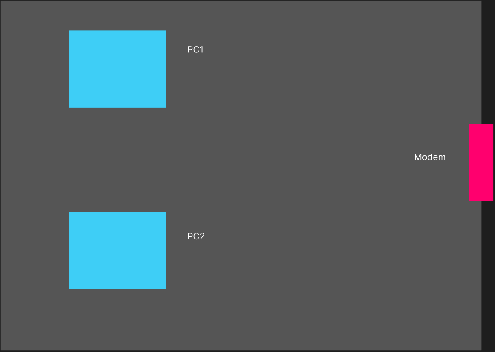
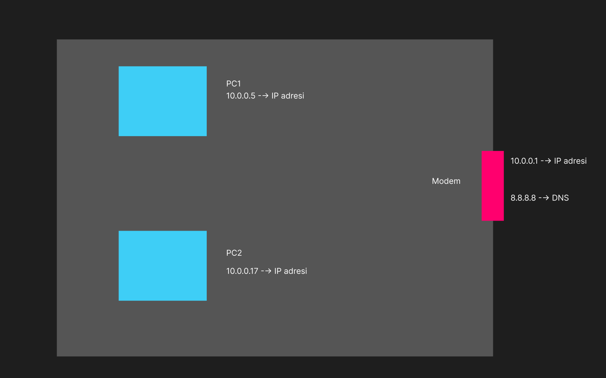
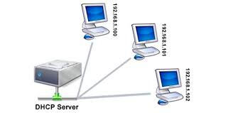
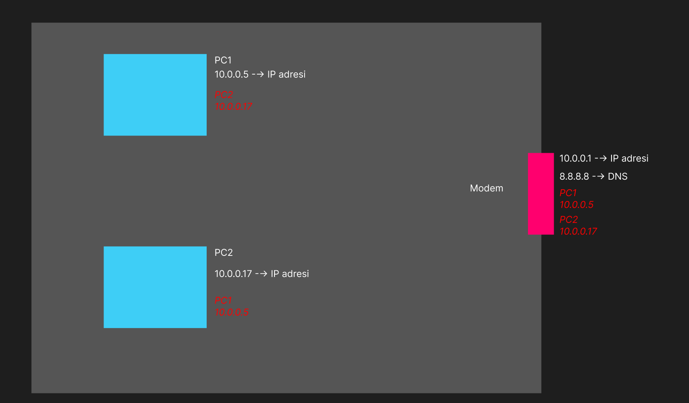
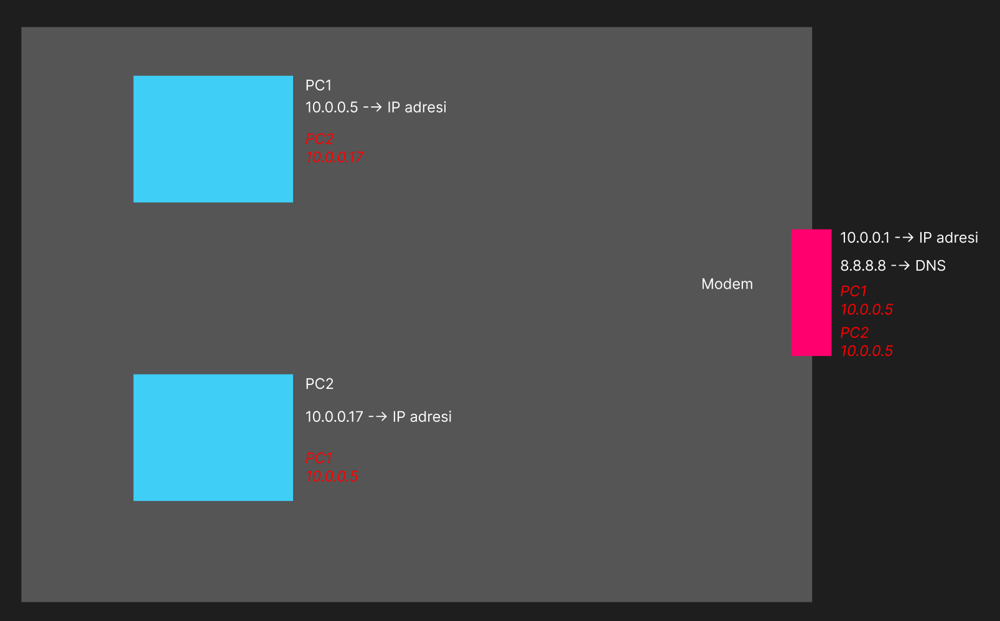
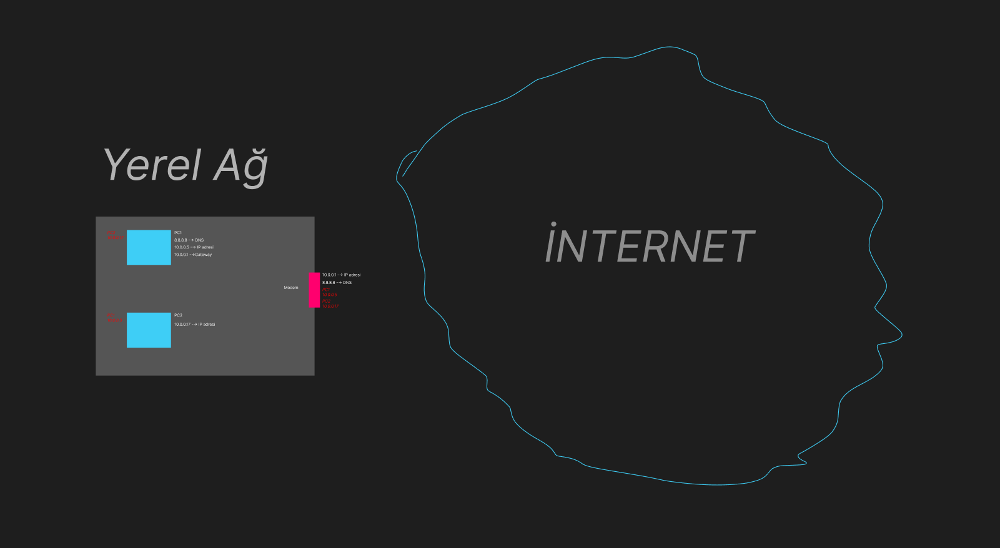
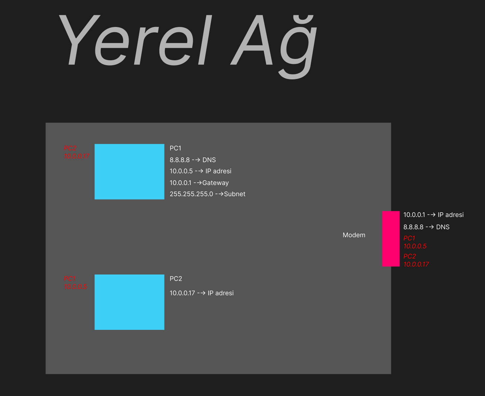
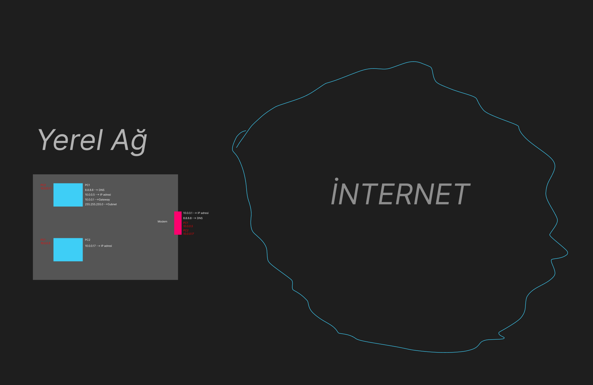

<h1 align="center">Bir Hacker’ın Gözünden Modern Web</h1>

Modern web'in nasıl çalıştığına dair temel bir anlatımla başlayalım.

İki bilgisayar ve bir modem düşünelim:

İlk başta bu iki bilgisayar da modemden ip adresi isteyecektir. Aksi takdirde web'e bağlanamaz:

Görüldüğü üzere iki bilgisayara da ip adresi tanımlandı. Bu işlem DHCP sayesinde olur.

## DHCP(Dynamic Host Configuration Protocol)

Dinamik Yapılandırma Protokolü olarak düşünebiliriz. Bu protokol, ağda bulunan her bir bilgisayarın ağ bağlantısı ayarlarının otomatik olarak atanmasını sağlar.

 

Görsele geri dönelim.

Şimdi yukarıda iki bilgisayar ve bir modem görüyoruz. Bu bilgisayarlar birbirleri ile ya da modem ile iletişim kurmadan önce ikinci layerda(OSI katmanlarını hatırlayalım. Burada 2. katman Data-Link'e denk gelir.) gerçekleşen bir durum söz konusudur. Bu söz konusu durumun adı ARP olarak kısaltılır.

## ARP(Address Resolution Protocol)

Adres çözümleme protokolü olarak adlandırılır. Adından da anlaşılacağı üzere bir tanımlama yapar. Verdiğimiz örnekte PC-1'in PC-2'yi tanımlamasında rol oynamaktadır. Bu işlem şöyle gerçekleşir; PC-1'in PC-2'yi tanımak istediği noktada PC-2'nin MAC adresinin bilinmesi gerekmektedir. Bunu aldıktan sonra PC-1, PC-2'nin MAC adresini **ARP tablosuna** kaydeder. Bu sayede artık PC-2 PC-1 için bilinir olur. ARP tablosunu da PC-1'in işletim sistemi yönetir. 

Görüldüğü üzere artık bilgisayarlarda birbirlerinin ip adresleri tanımlı ve bu adresler kendi ARP tablolarında kayıtlı şekilde duruyor. Aynı zamanda modemde de iki bilgisayarın ipleri tanımlı haldedir. 

## ARP Poisoning

ARP zehirlenmesi olarak düşünebiliriz. Aslında bu olguda ARP gerçekten de zehirleniyor. Çünkü ARP normalde farklı adresleri çözümlüyor ve tanımlıyordu. Bu sayede yerel ağ içerisindeki farklı cihazlar birbirinden haberdar oluyor ve birbirlerini tanımlıyordu. Ancak bir saldırganın yerel ağda bu kimlikleri değiştirip veri akışını yönlendirebilmesi mümkün oluyor. Örneğimiz üzerinden anlatalım: 

Burada iki bilgisayarda birbirini tanıyor haldeydi. Dolayısıyla modem de onları tanıyor. Ancak saldırgan bu ipleri değiştirip PC-2'nin kimliği olarak PC-1'inkini gösterebilir: 

Görüldüğü üzere modem'de artık iki bilgisayarın ipsi de aynı yani PC-1'inkine eşitlenmiş. Bu durumda modemin kurduğu veri aktarımında PC-2 dışarıda kalacaktır. Dolayısıyla PC-2, x.com diye bir siteye girdiğinde bir veri akışı oluşacaktır. Bu akış PC-1 tarafından izlenebilir hale gelecektir. Bu durum basitçe ARP poisoning olarak adlandırılır.

Görselimiz üzerinden devam edelim:

Anlattığımız görselde yerel ağdaki durumları konuşmuştuk. Peki internete nasıl bağlanıyoruz. Bir siteye girerken neler oluyor?

## Gateway(Geçiş Kapısı), Subnet(Alt ağ), DNS(Domain Name System)

* Gateway: İki farklı ağı birbirine bağlar ve verinin bu iki ağ arasında nasıl aktığını kontrol eder. Yerel ağımızı(LAN) internet'e bağlar. Örneğin, Evde(Yerel ağ) olduğunuzu düşünün ve sosyalleşmek(internet) istiyorsunuz. Sosyalleşmek için dışarı çıkmanız gerek. Dışarı çıkmanız için evin kapısından(gateway) geçmeniz gerek.

* Subnet: Subnet(subnetwork'ün kısaltması) büyük bir bilgisayar ağının küçük bir kısmını oluşturur. Subnet büyük ağları organize etmeyi, korumayı ve yönetmeyi daha verimli hale getirir. Örneğin bir şirket binası içerisindesiniz. Dolayısıyla birden fazla kat var. Bu katları subnet olarak düşünün. Her katta da şirketin farklı departmanların olduğunu düşünün. İlk katta resepsiyon, ikinci katta IT departmanı kısmı üçüncü katta reklam departmanı vs. Her kat(subnet) ayrı departmanlara bölündüğü için bu departmanlar kat içerisindeki iletişimi daha verimli yapacaklardır. Yani IT'ler kendilerine ait kata sahip olduğu için oradaki veri akışı daha temiz ve daha az dikkat dağıtıcı olacaktır. Diğer departmanlarla iletişim kurmak istediklerinde ise merdiven ya da asansörü kullanarak(bu durumda merdiven ve asansör modem görevini görür) o katlara gideceklerdir. İşte ağ'da da subnet'in görevi budur. Konuşmak istediğim kişiyle aynı ağda mıyım? sorusunu sorar. Ya da örneğimizden hareketle konuşmak istediğim kişiyle aynı katta mıyım? sorusu sorulur. Ağ içinde ağ olarak düşünebiliriz.     

* DNS: İnternetin telefon rehberi olarak düşünebiliriz. Website isimlerini bilgisayarların birbirlerini bulduğu ip adreslerine çevirir. Örneğin telefonumdan Ahmet'i arayacağım ve ismine tıklayıp arayabiliyorum. İnternete de **'www.facebook.com'** yazdığımda aslında benzer şey oluyor. Bilgisayarım DNS sunucusuna 'www.facebook.com'un adresi ne diye soruyor ve ardından DNS sunucusu ip adresini bulup bilgisayarımı bağlıyor ve ben de facebook'a girmiş oluyorum. 

Görüldüğü üzere DHCP'nin bilgisayara tanımladığı diğer ağ bağlantısı ayarlarını da ekledik. DNS, Gateway ve Subnet. 

Şimdi x.com isimli bir siteye gitmek istediğimizi düşünelim:

Bilgisayarımızın bu durum için internete bağlanması gerekecek. x.com'a bağlanmak istediğimiz için ve daha önce bu siteye girmediğimizi düşünürsek DNS'e x.com'un ip adresi bilgisayar tarafından sorulacak. Yani öncelikle DNS ile konuşulur.

## Bir İnternete Adresine Bağlanmak

x.com isimli bir websiteye bağlanmak istediğimizi varsayalım. Bilgisayarımız DNS'e(8.8.8.8- Bu DNS'in adı **Resolver** diye de geçer.) x.com'un ip adresini sorar. Eğer bu DNS ip adresini bilmiyorsa **Route DNS'e(Kök DNS)** gider ve ona sorar. **Route DNS**  **Resolver'a** ip'yi araması için başka bir adres verir. Bu sefer **Resolver**, **TLD(Top Level Domain)** DNS'ine gider ve x.com'un ip'sini burada arar. **TLD** de **Resolver'ı** kayıtları tutan bir adrese yönlendirir. Bu kayıt tutan adresin adı da **Authoritative DNS(Yetkili DNS)**'tir.**Resolver** sonunda burada x.com'un adresini bulur. Bu adres de bilgisayarımıza getirilir ve sonunda siteye girilir.   

## Riskler

* x.com'a bağlanırken çeşitli riskler söz konusu olabilir;

* İlk girildiğinde DNS'e bu adres kaydedilir. Ancak bir saldırganın DNS'e(8.8.8.8) sızdığı bir durumda bu adres değiştirilebilir ve bilgisayar tekrar x.com'a girmek istediğinde kendini saldırganın belirlediği bir ip adresinde bulabilir. 

* TLD kısmına sızıldığı takdirde tüm '.com' ile biten adresler istenilen adresler ile değiştirilebilir.

* Authoritative DNS(Yetkili DNS), ele geçirilirse ciddi anlamda veri sızıntısı yaşanabilir. Bu durumda tüm kayıtlar ve e postalar ele geçirilebilir hale gelir.

***'DNS internetin en zayıf halkasıdır' söylemi buradan gelmektedir.*** 

Bilgisayarımızın, ipsinin 1337 olduğunu düşündüğümüz bir sunucuya bağlandığını düşünelim. Burada aslında yukarıdaki adımları tamamlayıp bağlanıyoruz o yüzden hızlı geçtik. Şimdi bu bağlantı yapılırken bilgisayar protokol olarak TCP'yi kullanır. TCP paketinde;

Source Ip(Kaynak ip):bilgisayarın ipsidir. Örneğimizde 10.0.0.5.
Destination Ip(Hedef ip): 1337 olarak belirlemistik(rastgele bir değer)
Source Port(Kaynak port): Bu sayı işletim sistemi tarafından rastgele verilir.64357 diyelim.
Destination Port(Hedef port):80

## NAT(Network Address Translation)

TCP, bilgisayardan hedef sunucuya giderken Gateway'den geçecektir. Burada Gateway'den çıktıktan sonra bilgisayarın ipsi(10.0.0.5) yerine başka bir ip yazılır. Bu işleme NAT denmektedir. Ağ Adresi Değişimi olarak düşünebiliriz. İnternette gezinirken router'ın(modem) ürettiği farklı bir ip adresi bilgisayar ipsi olarak gözükür. Aynı zamanda örnekte gördüğümüz PC-1 ve PC-2'nin internette gezinirkenki ipleri de aynı olacaktır bu durumda. Çünkü router ikisine de aynı ip'yi atamaktadır. 

## Sunucuya Bağlanırken

Tekrardan 1337 ipli sunucuya bağlandığımız konuya dönelim. En son bilgisayar tcp'yi kullanarak gateway'den internete bağlanmıştı ve sunucuya ulaşmıştı. Şimdi burada bilgisayar sunucuya ilk defa gittiği için bir bağlantı oluşturacaktır. TCP kullanarak bağlantı oluşturan bilgisayar aslında **TCP SYN** paketini kullanır. Buradaki bahsi geçen **'SYN'** ***'synchronize'*** yani ***'senkronize'*** nin kısaltmasıdır ve sunucuya bağlantı isteğini gönderir. Sunucudan bir geri dönüş olacaktır ve bu geri dönüşün adı da **'SYN-ACK'** olarak adlandırılır. Buradaki **'ACK'** ***'acknowledge'***ın kısaltmasıdır yani ***'onaylamak'*** ya da ***'kabul etmek'***. Yani yanıt olarak sunucu ***'senkronize olmayı kabul ediyorum'*** diyor. Bundan sonra da kullanıcıdan yani bilgisayardan **'ACK'** tipinde bir cevap gelir ve bi önceki **'ACK'** ile aynı anlama gelir ve ***'son onay'*** olarak sunucuya cevap verir. Bu sürecin adı da ***'TCP 3 Way Handshake'*** olarak adlandırılır. Bi önceki derste bahsetmiştik. Bu süreç kimin kim olduğunun bilinmesi ile ilgilidir. Bir çeşit tanışma faslı.  