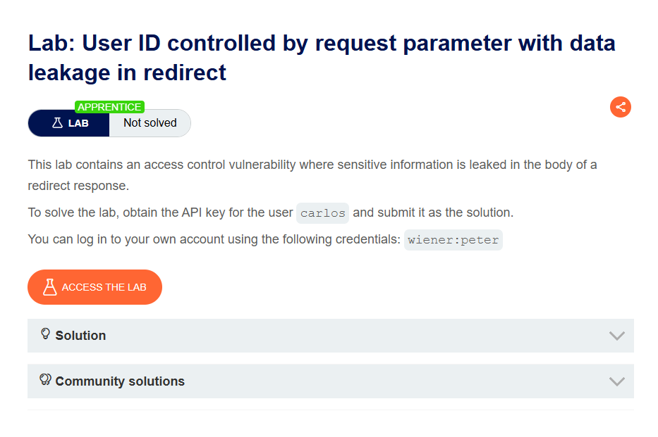
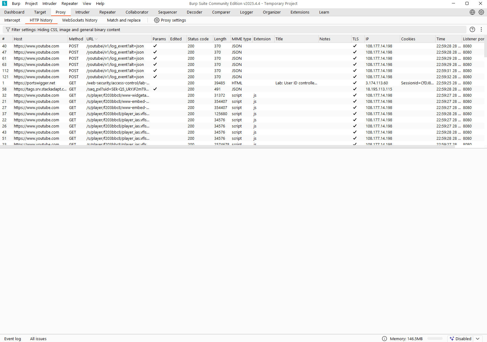
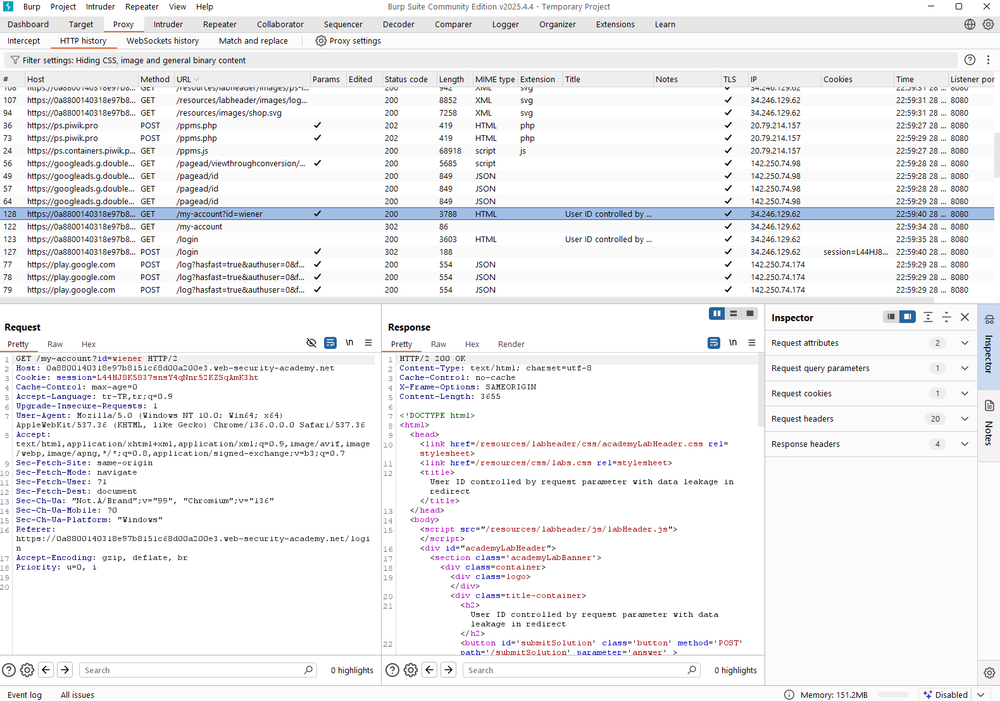
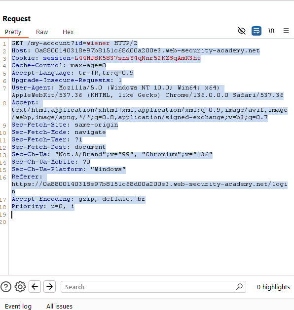
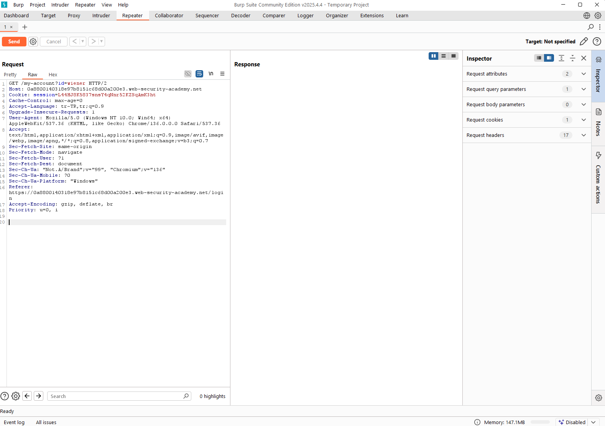
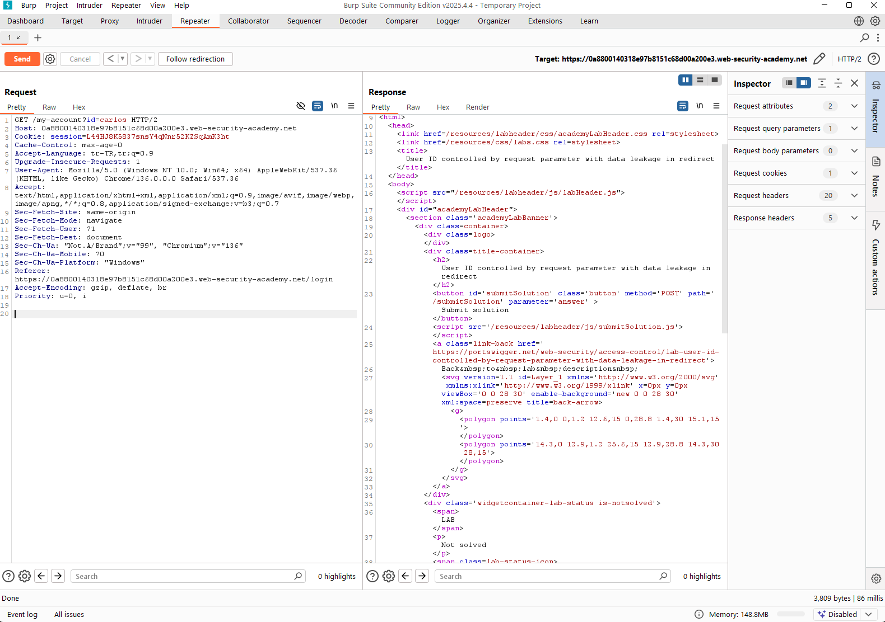
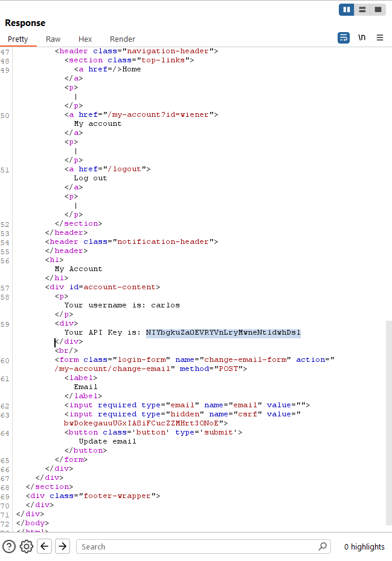
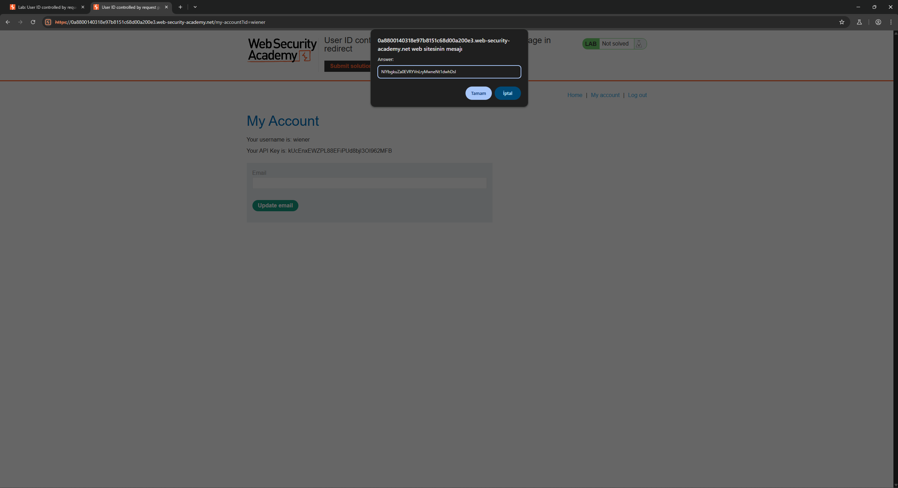
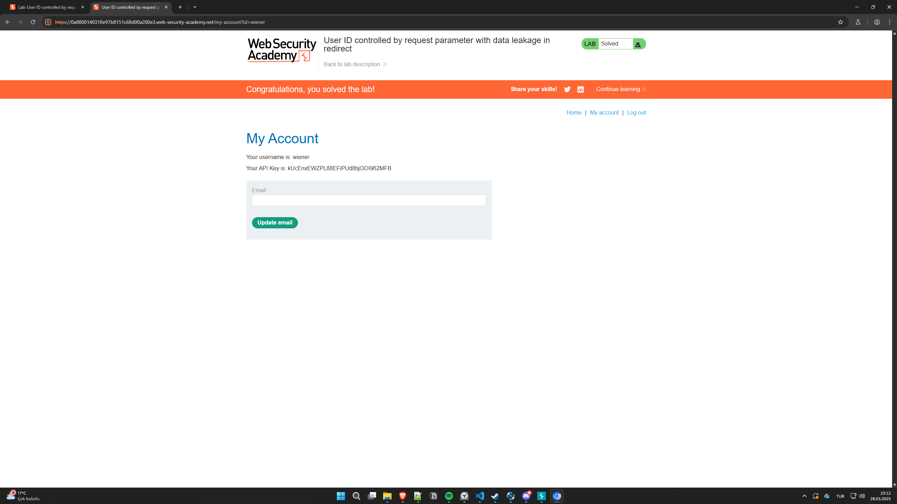

<h1 align="center">Biraz Portswigger Alıştırmaları</h1>

* Burpsuite kullanarak https://portswigger.net/ üzerinden birkaç alıştırma yapacağız.

* Burpsuite'i açalım ve Proxy kısmına gelip ***'Open Browser'*** tuşuna basalım.

* Açılan browser'da https://portswigger.net/ adresine gidelim ve kendimize bir hesap oluşturalım.

* Portswigger'da hesap oluşturup şifremizi kaydettikten sonra https://portswigger.net/web-security/all-labs#access-control-vulnerabilities buraya girelim.

* Buradan ***'User ID controlled by request parameter with data leakage in redirect'*** testine tıklayalım; 

* Yukarıda bu testteki erişim kontrol zaafiyetinin varlığından söz ediliyor. Bu testi çözebilmemiz için ***carlos*** kullanıcısının API key'ini bulmamızı istiyor. Ancak bize bunu wiener'in hesabına girerek yapmamızı istiyor. ***Access the Lab*** kısmına tıklayıp devam edelim;

* Açılan sayfada sağ üstte ***Account Login*** tuşuna basalım ve giriş kısmına ***wiener***, şifreye de ***peter*** yazalım;

* Giriş yaptıktan sonra BurpSuite uygulamasına gelelim ve **Proxy** sekmesi altındaki ***HTTP History*** sekmesine tıklayalım;

* Buradan biraz aşağı inip seçilmiş kısmı bulalım;

* Görüldüğü üzere burada weiner hesabındaki request ve response verilerini görebiliyoruz. Bize verilen görevde carlos'unkiler lazım.

* Bunu yapmak için sol alttaki ***Request*** adlı pencerede yazılan request kodunun tamamını seçip kopyalayalım;

* Bu sefer ***Proxy*** sekmesi yerine ***Repeater*** sekmesine gelip kopyaladığımız kodu ***Request*** penceresine yapıştıralım ve sonrasında ilk satırda yazan ***'GET /my-account?id=wiener HTTP/2'*** kısmında wiener yazan yere carlos yazalım;

* Ardından sol yukarıdaki ***Send*** tuşuna basalım ve çıkan küçük pencereye ok deyip tekrardan ***Send*** tuşuna basalım;

* Gördüğümüz gibi ***response*** kısmında artık carlos'a ait veriler var. Bu kısımdan biraz aşağı doğru inip ***carlos'a*** ait API anahtarını bulup kopyalayalım;

* Browser'a tekrar gelip submit solution kısmına tıkladıktan sonra kodu yapıştırıp Tamam tuşuna basalım.

* Böylece bir alıştırmayı çözmüş olduk. Görüldüğü üzere bize verilen hesap üzerinden giriş yaptık ve bu giriş bilgisinin sunucuya gönderdiği sorguyu Burpsuit ile yakaladık. Sonra buradaki bir girdiyi değiştirerek sunucuya başka bir sorgu yolladık. Bu sorgu başka bir kullanıcının bilgisini içerdiğinden sunucudan bize gelen response'da o kullancıya ait veriler çıktı. Basit bir IDOR zaafiyetini uygulamalı olarak yapmış olduk.
